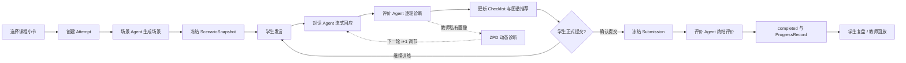
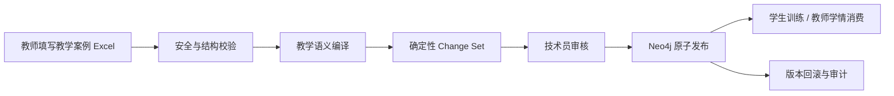
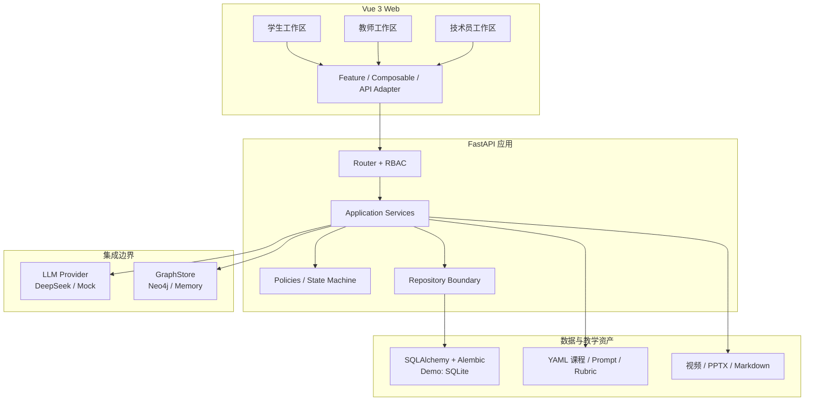

# AI 智能外贸谈判训练平台

> 把课堂搬到真实谈判桌，把每一次表达变成可复盘、可评价、可成长的学习证据。

**© AI赋能：智能时代的外贸谈判策略与实战项目组**

梁 诗 忻    软件设计

本项目是一个面向外贸与商务英语教学的多 Agent 智能训练平台。它不是“替学生写答案”的聊天机器人，而是一套围绕真实任务构建的教学系统：学生进入情境、亲自谈判、接受动态挑战、获得结构化评价；教师看到的不只是分数，还能追溯学生说了什么、用了什么策略、需要什么帮助以及下一步应该教什么。

项目以 [MIT License](./LICENSE) 开源，公开仓库为 [liangshixin1/AI-Smart-Foreign-Trade-Negotiation-Assistant](https://github.com/liangshixin1/AI-Smart-Foreign-Trade-Negotiation-Assistant)。重构前版本已冻结在 [`legacy/`](./legacy/LEGACY_NOTICE.md)，不作为当前运行时依赖。

截至 **2026年7月22日10:00（北京时间）**，项目达到 **Milestone 1：可展示 Demo**。谈判训练与教学知识图谱均已形成早期闭环，可以用于项目演示、内部试用、教学评审和下一阶段迭代；它仍是内测版本，不应被描述为已经达到生产部署标准。

## 里程碑快照

| 项目         | Milestone 1 状态                                    |
| ------------ | --------------------------------------------------- |
| 产品阶段     | 可展示、可操作、可追溯的内测 Demo                   |
| 课程版本     | `2.2.1-beta.22`                                     |
| 课程规模     | 9 个外贸流程、20 个结构化训练小节                   |
| 训练模式     | 谈判对话、商务邮件、文本/单证审阅                   |
| AI 架构      | 场景、对话、评价三个独立 Agent，三把独立 API Key    |
| 教学知识图谱 | 402 个内部节点、525 条关系；学生/教师端展示教学投影 |
| 数据库迁移   | Alembic `20260722_0012 (head)`                      |
| 自动化验证   | Web 20 项、API 37 项测试通过                        |
| 当前定位     | Demo / 教学验证版，而非生产正式版                   |

## 为什么值得做

传统语言练习常常止步于“答完一道题”，传统知识图谱也容易止步于“看见两个知识点有关”。本平台把两者推进到真实能力层面：

- **不是背知识，而是处理局面。** 客户压价、虚盘、付款拖延、投诉与单证风险都被组织为可训练的商务现象。
- **不是只给分，而是给证据。** 每个维度都能回到具体 Attempt、学生原话、场景快照、提示词版本和模型记录。
- **不是固定难度，而是动态调节。** 对话 Agent 根据教师私有的逐轮诊断，调整语言复杂度、商务压力和学生自主度。
- **图谱不是装饰，而是行动支持。** Neo4j 中的知识、策略和分级线索进入训练右栏，并根据最新对话由评价 Agent 从固定候选中选择、突出显示。
- **AI 不决定教学规则。** 身份、权限、课程解锁、Attempt 完成、进度统计和分数落库都由确定性代码控制。

## 四类用户，四个工作区

### 学生：开启你的外贸谈判之旅

学生沿课程路线进入训练，完成“场景—实战—评价—复盘”的完整闭环。

- 查看课程进度、关卡状态、最近反馈和历史 Attempt。
- 进入训练前了解学习目标、角色、任务、时长和评价维度。
- 场景 Agent 生成一次性场景并保存快照，刷新页面不会换题。
- 对话 Agent 通过 SSE 流式扮演客户或交易对手。
- 学生消息先保存再调用 AI；断网或模型失败不会丢失输入。
- 每轮由评价 Agent 生成分数、Pros、Cons、详细评价、下一步建议和 Checklist。
- 训练右栏集中呈现“你可能所需要的”知识资源、策略技巧和线索提示；最新推荐以不同颜色突出。
- 草稿自动保存，长对话自动跟随；主动上滑时出现“回到最新消息”。
- 正式提交前二次确认；提交后冻结场景、消息和内容版本。
- 正式评价展示总体结果、维度分、雷达图、优点、改进、证据和下一步行动。
- 评价失败可直接重试，不需要重新谈判。
- 浏览“现象—知识资源—策略战术”知识图谱，查看 Markdown 精讲、视频和 PPTX。
- 只有评价成功并进入 `completed` 的 Attempt 才计入完成进度。

开发环境账号：`student@example.test`。密码只通过本地 `DEV_SEED_PASSWORD` 配置，不写入仓库。

### 教师：从结果走回过程，从班级走到证据

教师工作区用于管理内测班级、追踪学情并复盘学生的真实谈判过程。

- 班级总览：学生数、7日活跃、完成训练数、平均分和关注人数。
- 风险规则：长期未训练、连续低分、多次重练未达标、评价失败待恢复。
- 学生列表：搜索、筛选、排序以及新增、编辑、移出学生。
- 名册导入：当前支持 UTF-8 CSV 的整批预校验与原子提交。
- 学生详情：课程进度、历史 Attempt、能力维度、薄弱点和训练时间线。
- 完整回放：场景快照、全部消息、正式提交、逐轮反馈、正式评价和引用证据。
- 教师私有 ZPD 诊断：知识掌握、语言控制、谈判策略、应变能力、跨文化语用、自我调节，以及谈判风格、最低帮助和下一发展目标。
- 图谱学情：把完成记录映射到现象、知识资源和策略，统计线索展开、采用与薄弱关卡。
- 教学知识图谱：Cytoscape.js 二维浏览、搜索、类型筛选和邻接关系追溯。
- 学习内容维护：Markdown 编辑、视频/PPTX上传、教师预览、发布状态控制。

开发环境账号：`teacher@example.test`。密码只通过本地环境配置。

### 技术员：管理模型与知识发布，不越过教学边界

技术员负责平台运行参数和知识图谱发布治理，不代替教师评价学生，也不修改学生完成状态。

- 分别配置场景、对话、评价 Agent 的模型和 API Key。
- 校验三把 Key 全部存在且互不相同；Key 只写入，不回显。
- 配置 DeepSeek API 基址、超时与重试策略，并独立测试三个 Agent。
- 下载“教师教学知识图谱 DSL 2.0”Excel模板并导入教学案例。
- 查看按工作表、行、列定位的校验问题和确定性图谱变更集。
- 审核后原子发布到 Neo4j；发布失败不切换活动版本。
- 查看活动版本、执行回滚并保留审计事件。

开发环境账号：`technician@example.test`。生产环境必须改用专用密钥管理方案。

### 开发人员：在稳定边界上继续迭代

开发者面对的不是一个“万能 AI Service”，而是可独立测试的业务模块、版本化教学内容和明确的外部适配器。页面只组合 Feature，路由只处理鉴权与输入输出，业务规则位于应用服务，数据访问经过 Repository，LLM 与 Neo4j 都位于集成边界。

## 一次训练如何运行



三个 Agent 各自承担单一职责：

| Agent      | 输入                                           | 输出                                              | 明确不能做                       |
| ---------- | ---------------------------------------------- | ------------------------------------------------- | -------------------------------- |
| 场景 Agent | 小节模板、难度、图谱局面背景                   | 公开场景、私有角色条件、开场白                    | 修改课程、决定解锁、泄露私有底线 |
| 对话 Agent | 场景私有条件、对话历史、图谱候选、最新学习诊断 | 角色内的流式回应                                  | 评分、完成 Attempt、直接更新进度 |
| 评价 Agent | 学生证据、量规、逐轮对话、图谱候选             | 逐轮反馈、Checklist、推荐、正式评价、教师私有诊断 | 身份认证、权限判断、虚构学生原话 |

## 教育学设计：理论必须落到交互和数据

| 理论视角             | 在系统中的落地方式                                       | 可观察证据                                   |
| -------------------- | -------------------------------------------------------- | -------------------------------------------- |
| 成果导向教育（OBE）  | 学习目标→真实任务→评价量规→行动建议形成反向设计          | 小节目标、Rubric、Submission、维度证据       |
| 建构性对齐           | 训练任务、评价维度和课程目标绑定同一内容版本             | CourseVersion、TrainingUnit、Rubric 版本关联 |
| 情境学习与体验学习   | 学生在角色、约束、产品、条款和关系压力中作出真实选择     | 场景快照、完整消息、谈判结果                 |
| 最近发展区（ZPD）    | 比较独立表现与在最低帮助下的潜在表现                     | 挑战等级、支持等级、下一发展目标             |
| 动态评价             | 评价 Agent 每轮诊断，并把诊断送入下一轮对话              | RoundEvaluation 与教师私有发展轨迹           |
| `i+1` 可理解输入     | 语言复杂度、商务压力和自主度只提高一个合理台阶           | 下一轮对话提示词中的自适应参数               |
| 脚手架与渐隐支持     | 明确示范→引导选择→隐性提示→独立完成                      | 线索展开/采用事件、最低帮助等级              |
| 输出假设             | 学生必须产出真实商务语言，AI不能替学生完成任务           | 学生 Message、正式冻结文本、引用证据         |
| 形成性评价与注意机制 | 每轮 Pros/Cons、Checklist 和推荐让学生注意表达与策略差距 | 逐轮反馈、自动更新的自查项                   |
| 掌握学习             | 建立会话或发过消息不算完成，只有评价成功才进入进度       | Attempt 状态与 ProgressRecord                |

ZPD 与 `i+1` 在这里互补但不混同：前者关注“帮助下可达到的潜在水平”，后者关注“略高于当前水平且可理解的输入”。系统用动态评价估计前者，再用三轴难度控制实现后者。

## 知识图谱：从“知识之间有关”走向“遇到局面时会行动”

知识图谱不设置唯一知识点根节点，而由多类教学对象共同构成：

- `Scenario`：课程中的可训练任务。
- `Phenomenon`：客户压价、虚盘、付款拖延、投诉等关键局面。
- `Terminology`、`TradeRule`、`DocumentKnowledge`、`BusinessProcess`、`CommunicationKnowledge`、`MarketKnowledge`：可学习、可引用的知识资源。
- `NegotiationStrategy`：条件让步、利益交换、锚定、澄清与风险控制等策略战术。
- `Scaffold`：分级线索、句框和认知提示；前端统一称“线索提示”。
- `RubricDimension` 与 `NegotiationOutcome`：连接行动、结果与评价。

内部图谱使用 `EXPOSES`、`ADDRESSES`、`SUPPORTS`、`SCAFFOLDS`、`ASSESSES_WITH`、`MAY_LEAD_TO` 等稳定关系。Milestone 1 演示数据包括：

| 节点类型              |                    数量 |
| --------------------- | ----------------------: |
| Scenario              |                      20 |
| Phenomenon            |                      40 |
| 知识资源              |                      77 |
| NegotiationStrategy   |                      25 |
| Scaffold              |                      80 |
| RubricDimension       |                      60 |
| NegotiationOutcome    |                      40 |
| 其他角色/学习成果节点 |                      60 |
| **合计**              | **402 节点 / 525 关系** |

学生和教师看到的是克制的“现象—知识资源—策略战术”教学投影，而不是把全部内部节点堆到一张大图。训练中的智能推荐采用“**Neo4j 固定候选 + LLM 根据最新对话选择**”：图谱保证候选可信、关系可追溯，模型负责判断此刻最需要哪一项，不能生成候选集合之外的节点。

### 教师 DSL 到 Neo4j 的发布链



教师面对的是可理解的案例、关键局面、应对策略、知识材料、分级提示和评价量规；Neo4j 标签、关系类型、稳定ID和版本隔离由后台生成，避免把数据库建模负担转嫁给一线教师。

## 系统架构



### 分层职责

- **表现层**：Vue SFC 页面与组件，Composition API，页面只负责组合。
- **Feature层**：Composable、类型和 API Adapter 承担可复用状态与交互流程。
- **路由层**：鉴权、参数接收、调用用例、返回 Pydantic 响应。
- **应用服务层**：Attempt 状态、提交冻结、评价、教师分析、图谱发布等业务规则。
- **Repository层**：隔离 SQLAlchemy 查询和持久化细节。
- **集成层**：统一 LLM Provider、GraphStore、结构化输出和流式事件。
- **内容层**：课程、训练模板、提示词和量规都在 Python 代码之外独立版本化。

### 技术栈

| 层           | 技术                                                               |
| ------------ | ------------------------------------------------------------------ |
| Web          | Vue 3、TypeScript strict、Vite、Vue Router、Pinia                  |
| 可视化与媒体 | Cytoscape.js、Video.js、Vue Office PPTX                            |
| API          | FastAPI、Pydantic、SQLAlchemy                                      |
| 数据迁移     | Alembic                                                            |
| LLM          | DeepSeek `/chat/completions`、JSON Object、SSE；本地 Mock Provider |
| 图数据库     | Neo4j 5.26 LTS、Neo4j Python Driver                                |
| Demo关系库   | SQLite；生产化方向为 PostgreSQL                                    |
| 质量工具     | ESLint、Prettier、Vue TSC、Ruff、Mypy、Vitest、Pytest              |

## 领域数据与可追溯性

核心实体包括：

- 身份与班级：`User`、`Role`、`Classroom`、`Enrollment`。
- 课程内容：`Course`、`CourseVersion`、`Chapter`、`TrainingUnit`、`TrainingTemplate`、`PromptTemplate`、`Rubric`。
- 训练证据：`Attempt`、`ScenarioSnapshot`、`Message`、`Submission`、`AttemptEvent`。
- 评价进度：`RoundEvaluation`、`Evaluation`、`EvaluationDimension`、`CompetencyEvidence`、`ProgressRecord`。
- 图谱治理：导入任务、校验问题、变更集、发布版本、审计事件、线索互动、学习内容与媒体资产。

每次 Attempt 都绑定课程版本、提示词版本、模型信息、图谱版本和场景快照。正式提交冻结对话内容；重练创建新 Attempt，并通过 `retry_of_attempt_id` 保留来源关系。

### Attempt 状态机

```text
not_started
  → generating_scenario
  → in_progress
  → submitted
  → evaluating
  → completed

异常：
generating_scenario → generation_failed
evaluating          → evaluation_failed → evaluating
completed           → retry_created（创建新 Attempt）
```

状态转换由代码控制，不由模型自由决定。提交、消息重发、重练和图谱互动均使用稳定幂等键或唯一约束。

## API 边界

开发环境在 `http://127.0.0.1:8000/docs` 提供 OpenAPI。主要资源边界如下：

| 资源       | 代表性端点                                                                                |
| ---------- | ----------------------------------------------------------------------------------------- |
| 认证与本人 | `POST /api/v1/auth/login`、`refresh`、`logout`、`GET /api/v1/me`                          |
| 课程       | `GET /api/v1/courses/current/map`、`GET /api/v1/units/{unit_id}`                          |
| 训练       | `POST /api/v1/attempts`、`GET /attempts/{id}`、草稿、消息、流式消息、提交、评价重试、重练 |
| 学生进度   | `GET /api/v1/me/progress`、`GET /api/v1/attempts`                                         |
| 教师学情   | 班级总览、学生列表、学生详情、Attempt回放、学生CRUD与名册导入                             |
| 图谱学习   | 学生/教师图谱、训练线索、互动事件、学习内容和媒体读取                                     |
| 图谱治理   | Excel导入、问题清单、教学预览、Change Set审核、发布与回滚                                 |
| 技术员     | LLM配置读取/保存、三 Agent 连通性测试                                                     |

SSE 使用稳定事件：`message.started`、`message.delta`、`message.completed`、`message.failed`、`round_evaluation.started`、`round_evaluation.completed`、`round_evaluation.failed`、`stream.closed`。前端不依赖随意拼装的 JSON 片段。

统一错误响应包含稳定错误码、用户可读消息、`retryable` 和请求关联ID。日志不得记录密码、Token、API Key或完整敏感对话。

## 项目目录

以下目录来自 Milestone 1 当前仓库的实际文件，而不是目标架构占位。目录说明同时回答“代码在哪里”和“它负责什么”，便于产品、教学、前端、后端与测试人员快速接手。

### 顶层结构

```text
.
├── .github/workflows/ci.yml  # 持续集成：静态检查、测试与构建
├── apps/
│   ├── api/                  # FastAPI、领域模块、适配器、迁移与接口测试
│   └── web/                  # Vue 3 页面、Feature、组件与前端测试
├── content/
│   ├── curriculum/           # 课程版本与20个小节
│   ├── prompts/              # 场景、对话、逐轮评价、终结评价提示词
│   ├── rubrics/              # 谈判、邮件、单证量规
│   ├── training-templates/   # 训练模式模板
│   └── knowledge-graph/      # 教师DSL正式模板
├── docs/                     # 审计、架构、工单、评审、就绪度与手工验收
├── legacy/                   # 重构前公开版本的只读工作树快照
├── scripts/                  # 内容迁移、真实服务冒烟测试和质量检查
├── compose.yaml              # 本地 Neo4j 5.26 LTS
├── package.json              # 工作区统一质量命令
├── pnpm-workspace.yaml       # pnpm 多应用工作区声明
└── README.md                 # 产品、架构、运行与交接总纲
```

`legacy/` 不是兼容层。它保留旧公开版本的源码和文档，帮助追溯为什么放弃 Flask、Vanilla JavaScript、巨型 Service 和运行时复杂图谱等实现；任何新功能都不得从这里导入代码。快照来源、提交号和安全边界见 [Legacy 版本说明](./legacy/LEGACY_NOTICE.md)。

### 后端 `apps/api`

后端按照业务能力组织。路由只处理协议、鉴权和响应；业务规则进入服务；数据库访问进入 Repository；DeepSeek 与 Neo4j 均位于统一适配层。

#### 应用入口、基础设施与外部集成

| 路径                                              | 职责                                                             |
| ------------------------------------------------- | ---------------------------------------------------------------- |
| `app/main.py`                                     | 创建 FastAPI 应用、注册路由、中间件和统一错误处理。              |
| `app/cli.py`                                      | 提供初始化、课程导入等离线管理入口，避免把重型工作放入启动过程。 |
| `app/core/config.py`                              | 从环境变量读取数据库、三个 Agent、Neo4j 与上传配置。             |
| `app/core/security.py`                            | 密码哈希、JWT签发与身份安全工具。                                |
| `app/core/errors.py`                              | 定义稳定业务错误与统一 API 错误结构。                            |
| `app/core/logging.py`                             | 配置结构化日志和敏感信息边界。                                   |
| `app/db/base.py`                                  | 汇总 SQLAlchemy 模型元数据，供 Alembic 使用。                    |
| `app/db/session.py`                               | 管理数据库引擎、事务与会话生命周期。                             |
| `app/db/types.py`                                 | 封装数据库通用字段类型。                                         |
| `app/integrations/llm/base.py`                    | 定义与厂商无关的 LLM Provider 契约。                             |
| `app/integrations/llm/deepseek.py`                | 实现 DeepSeek 普通、流式与结构化调用。                           |
| `app/integrations/llm/mock.py`                    | 为测试和无密钥开发提供可预测模型响应。                           |
| `app/integrations/llm/factory.py`                 | 根据配置创建场景、对话、评价 Agent Provider。                    |
| `app/integrations/llm/prompt_renderer.py`         | 加载版本化提示词并校验输入变量后渲染。                           |
| `app/integrations/llm/structured_output.py`       | 提取、修复并校验大模型 JSON 输出。                               |
| `app/integrations/knowledge_graph/base.py`        | 定义知识图谱存储端口。                                           |
| `app/integrations/knowledge_graph/neo4j.py`       | 正式 Neo4j 图数据读写实现。                                      |
| `app/integrations/knowledge_graph/memory.py`      | 测试和轻量开发使用的内存图实现。                                 |
| `app/integrations/knowledge_graph/unavailable.py` | Neo4j 不可用时返回明确、可诊断的降级状态。                       |
| `app/integrations/knowledge_graph/factory.py`     | 按运行配置选择图存储实现。                                       |
| `app/integrations/streaming/sse.py`               | 生成具有稳定事件名和载荷格式的 SSE 响应。                        |

#### 训练闭环模块 `app/modules/training`

| 文件                          | 职责                                                                         |
| ----------------------------- | ---------------------------------------------------------------------------- |
| `models.py`                   | Attempt、ScenarioSnapshot、Message、Submission 与 LLM 调用记录等持久化模型。 |
| `schemas.py`                  | 创建训练、收发消息、提交、重试与读取训练的 Pydantic 契约。                   |
| `state.py`                    | Attempt 合法状态转换和完成判定；状态不交给大模型决定。                       |
| `access.py`                   | 学生本人、任课教师等训练资源访问策略。                                       |
| `repository.py`               | 训练聚合的数据读取、锁定、保存和幂等查询。                                   |
| `attempt_creation_service.py` | 创建 Attempt、绑定课程/提示词版本并只生成一次场景快照。                      |
| `conversation_service.py`     | 保存学生输入并组织非流式对话调用，失败时保留学生消息。                       |
| `streaming_context.py`        | 为流式回复准备版本、历史消息、图谱与诊断上下文。                             |
| `streaming_service.py`        | 输出对话 SSE、落库 AI 回复并触发逐轮形成性评价。                             |
| `submission_service.py`       | 冻结正式内容、创建 Submission、发起终结评价并维护幂等性。                    |
| `recovery_service.py`         | 恢复生成或评价失败的 Attempt，不覆盖原始证据。                               |
| `adaptive_learning.py`        | 将教师可见的水平诊断转成对话 Agent 的最近发展区提示。                        |
| `invocations.py`              | 记录 provider、模型、用途、提示词版本、用量与错误分类。                      |
| `hashing.py`                  | 为幂等请求、内容快照提供稳定摘要。                                           |
| `presenter.py`                | 组装对外响应并隔离内部字段与学生不可见诊断。                                 |
| `service.py`                  | 向路由提供稳定训练用例门面，协调上述细粒度服务。                             |
| `router.py`                   | 暴露 Attempt、消息、流式对话、提交、评价重试与重练 API。                     |

#### 评价模块 `app/modules/assessment`

| 文件                       | 职责                                                             |
| -------------------------- | ---------------------------------------------------------------- |
| `models.py`                | Evaluation、维度分、能力证据与逐轮诊断持久化模型。               |
| `schemas.py`               | 总分、Pros、Cons、详细评价、下一步建议、维度和证据等结构化契约。 |
| `structured_evaluation.py` | 校验评价 JSON、证据来源和维度分与总分一致性。                    |
| `round_service.py`         | 每轮对话后生成 Checklist 与隐式学习诊断。                        |
| `diagnostic.py`            | 聚合知识掌握、谈判风格、语言产出、应变能力等发展信号。           |
| `service.py`               | 执行终结评价、失败恢复、进度落账与评价读取。                     |

#### 知识图谱模块 `app/modules/knowledge_graph`

| 文件                                 | 职责                                                     |
| ------------------------------------ | -------------------------------------------------------- |
| `contract.py` / `v2_contract.py`     | 定义教师 Excel 教学设计语言的工作表、列和语义契约。      |
| `xlsx_parser.py`                     | 安全读取工作簿并保留可定位到表、行、列的问题信息。       |
| `validation.py` / `v2_validation.py` | 校验必填项、引用、枚举、复用关系和发布条件。             |
| `compiler.py` / `v2_compiler.py`     | 将教师案例 DSL 编译为节点、关系、学习资源和 Change Set。 |
| `import_service.py`                  | 组织上传、预检、差异审核、发布、替换和回滚流程。         |
| `review_service.py`                  | 生成技术员/专家可读的问题清单、变更摘要与教学预览。      |
| `repository.py`                      | 保存导入批次、发布版本、节点内容与关系元数据。           |
| `models.py`                          | 图谱导入、学习内容、媒体资产和学习证据等关系库模型。     |
| `types.py`                           | 图谱领域枚举、值对象和内部类型。                         |
| `schemas.py`                         | 图谱导入、可视化、推荐、内容编辑与学习证据 API 契约。    |
| `consumption_service.py`             | 生成学生/教师 Cytoscape 图投影、统计和图谱洞察。         |
| `scaffold_service.py`                | 按 Scenario 和 Phenomenon 召回固定知识、策略与线索候选。 |
| `recommendation_service.py`          | 在固定图谱候选中让 LLM 根据最新对话选择本轮高亮项。      |
| `prompt_context.py`                  | 把经验证的图谱候选注入场景、对话与评价提示词。           |
| `content_service.py`                 | 编辑 Markdown 精讲，上传、读取和删除视频/PPT学习资产。   |
| `learning_evidence_service.py`       | 记录学生查看资源、接受提示等可用于教师分析的学习证据。   |
| `router.py`                          | 提供导入治理、学生/教师图谱、训练推荐和学习内容 API。    |

#### 其他业务模块

| 模块及文件                                                                                    | 职责                                                      |
| --------------------------------------------------------------------------------------------- | --------------------------------------------------------- |
| `auth/models.py`、`repository.py`、`service.py`、`schemas.py`、`router.py`、`dependencies.py` | 用户与角色持久化、登录、当前用户、JWT鉴权和路由权限依赖。 |
| `classrooms/models.py`                                                                        | Classroom 与 Enrollment 班级成员关系模型。                |
| `curriculum/content_schemas.py`                                                               | 校验 YAML 课程、章节、小节、训练模板、量规与提示词内容。  |
| `curriculum/import_repository.py`、`import_service.py`                                        | 将发布版内容资产以版本化方式导入数据库。                  |
| `curriculum/models.py`、`repository.py`、`service.py`、`schemas.py`、`router.py`              | 课程版本、路线图、小节详情、先修与排序的完整查询链路。    |
| `progress/models.py`、`router.py`                                                             | 仅依据 `completed` Attempt 提供学生正式进度和历史。       |
| `teacher_analytics/service.py`、`student_metrics.py`、`competency.py`                         | 聚合班级完成率、学生进度、风险原因、能力维度与薄弱点。    |
| `teacher_analytics/roster_service.py`                                                         | 学生 CRUD、班级成员维护与 Excel 名册导入。                |
| `teacher_analytics/schemas.py`、`router.py`                                                   | 教师总览、学生筛选、详情与完整训练回放 API。              |
| `technician/service.py`、`schemas.py`、`router.py`                                            | 三 Agent 参数治理、脱敏展示与连接测试。                   |
| `workspaces/router.py`                                                                        | 提供各角色工作区健康与初始化状态。                        |

#### 数据库迁移与后端测试

- `alembic/versions/0001` 至 `0012` 按时间建立认证、课程、训练、逐轮反馈、故障恢复、Checklist、教师 DSL 图谱、图谱消费、学习内容、媒体上传和 ZPD 诊断；所有数据库变化都必须继续追加迁移，禁止修改已执行版本。
- `tests/test_auth.py`、`test_curriculum.py` 验证认证、权限与课程读取。
- `tests/test_training_flow.py`、`test_evaluation_recovery.py` 验证状态机、流式训练、提交、评价与失败恢复。
- `tests/test_knowledge_graph_import.py`、`test_knowledge_graph_phase2.py`、`test_knowledge_graph_v2.py` 验证 DSL 导入、Neo4j 消费、内容和推荐闭环。
- `tests/test_teacher_technician.py` 验证教师学情、名册和技术员配置权限。
- `tests/test_deepseek_provider.py` 验证 DeepSeek 协议适配；`test_migrations.py`、`test_system.py` 验证迁移和系统级契约。

### 前端 `apps/web/src`

前端遵循“页面组合、Feature 承担业务、API 不散落、组件单一职责”。`app/router` 负责角色守卫，`RoleWorkspaceLayout.vue` 统一三端导航，`shared` 提供无业务倾向的基础能力。

#### 页面地图

| 页面                                            | 面向角色与职责                                                 |
| ----------------------------------------------- | -------------------------------------------------------------- |
| `pages/LoginPage.vue`                           | 登录入口、品牌信息与角色认证。                                 |
| `pages/ForbiddenPage.vue`                       | 越权访问的明确反馈与安全返回入口。                             |
| `pages/student/StudentHomePage.vue`             | 学生路线、总体进度、最近表现、推荐下一步与知识学习入口。       |
| `pages/student/UnitPreparationPage.vue`         | 展示目标、时长、场景、角色、任务和评价维度，并创建或恢复训练。 |
| `pages/student/TrainingWorkspacePage.vue`       | 组合场景栏、模式工作台、对话、Checklist 和智能学习支持。       |
| `pages/student/EvaluationPage.vue`              | 呈现结论、雷达图、维度摘要、证据、行动建议与重练入口。         |
| `pages/student/StudentKnowledgeGraphPage.vue`   | 浏览现象—知识资源—策略战术图谱。                               |
| `pages/student/StudentKnowledgeContentPage.vue` | 学习 Markdown 精讲、视频和 PPT，并记录学习行为。               |
| `pages/teacher/TeacherHomePage.vue`             | 班级总览、学生筛选、风险提醒和名单治理。                       |
| `pages/teacher/TeacherStudentDetailPage.vue`    | 单个学生路线、时间线、能力趋势、薄弱点和历史 Attempt。         |
| `pages/teacher/TeacherAttemptReplayPage.vue`    | 回放场景、完整对话、提交、评价证据和教师可见诊断。             |
| `pages/teacher/TeacherKnowledgeGraphPage.vue`   | Cytoscape 图谱、图谱统计、现象关系和教学洞察。                 |
| `pages/teacher/TeacherKnowledgeContentPage.vue` | 编辑 Markdown、上传并预览视频/PPT学习内容。                    |
| `pages/technician/TechnicianHomePage.vue`       | 管理三 Agent 配置、知识图谱导入预检、发布和回滚。              |

#### 训练 Feature `features/training`

| 组件/模块                                | 职责                                               |
| ---------------------------------------- | -------------------------------------------------- |
| `components/TrainingWorkspaceShell.vue`  | 全高三栏训练布局、左右侧栏收展和移动端组织。       |
| `components/NegotiationWorkspace.vue`    | 谈判对话模式容器。                                 |
| `components/EmailWorkspace.vue`          | 商务邮件撰写模式容器。                             |
| `components/DocumentReviewWorkspace.vue` | 文本或单证审阅模式容器。                           |
| `components/ScenarioBrief.vue`           | 展示场景背景、角色、标的、约束和本轮任务。         |
| `components/ConversationTimeline.vue`    | 渲染完整消息、流式增量、自动跟随与“回到最新消息”。 |
| `components/MessageComposer.vue`         | 输入、快捷键发送、禁用态和失败保护。               |
| `components/TrainingChecklist.vue`       | 展示每轮自动更新的“看看自己做到了……”形成性提醒。   |
| `components/RoundFeedbackCard.vue`       | 以克制方式呈现每轮分数、Pros、Cons 和下一步建议。  |
| `components/SubmitAttemptDialog.vue`     | 正式提交前确认并说明内容冻结后果。                 |
| `components/AutosaveIndicator.vue`       | 显示草稿保存中、已保存和失败重试状态。             |
| `components/AttemptHistoryList.vue`      | 展示历史 Attempt、状态、分数和恢复/回看入口。      |
| `composables/useAttempt.ts`              | 加载 Attempt、收发消息、流式状态和提交协调。       |
| `composables/useAttemptDraft.ts`         | 本地草稿、自动保存与刷新恢复。                     |
| `composables/useStartAttempt.ts`         | 防重复地创建或继续训练。                           |
| `composables/useAttemptHistory.ts`       | 查询和整理学生历史训练。                           |
| `api/trainingApi.ts`、`types.ts`         | 集中训练 HTTP/SSE 调用和严格 TypeScript 契约。     |

#### 知识图谱 Feature `features/knowledge-graph`

| 组件/模块                                                                | 职责                                                           |
| ------------------------------------------------------------------------ | -------------------------------------------------------------- |
| `components/KnowledgeGraphCanvas.vue`                                    | 封装 Cytoscape.js 画布、布局、缩放、选择和高亮。               |
| `components/KnowledgeGraphExplorer.vue`                                  | 组合图谱筛选、图例、详情和响应式交互。                         |
| `components/KnowledgeInsightPanel.vue`                                   | 呈现教师侧图谱覆盖、薄弱现象和学习行为洞察。                   |
| `components/KnowledgeEvidenceReplay.vue`                                 | 将学生图谱学习证据与具体训练回放关联。                         |
| `components/TrainingKnowledgeScaffold.vue`                               | 右栏“你可能需要的”知识、策略和线索支持库；新增推荐用颜色区分。 |
| `components/MarkdownLearningContent.vue`                                 | 安全渲染理论精讲 Markdown。                                    |
| `components/LearningVideoPlayer.vue`                                     | 播放上传的视频资产并处理加载失败。                             |
| `components/LearningPptxViewer.vue`                                      | 在浏览器内预览上传的 PPTX。                                    |
| `components/LearningMediaGallery.vue`                                    | 统一编排学习视频、PPT和空/错状态。                             |
| `components/LearningAssetUploader.vue`                                   | 教师上传、替换、预览和删除视频/PPT。                           |
| `composables/useAttemptScaffold.ts`                                      | 获取固定候选并合并每轮 LLM 高亮推荐。                          |
| `composables/useKnowledgeInsights.ts`                                    | 获取教师图谱统计与学习洞察。                                   |
| `composables/useLearningContent.ts`                                      | 读取和保存 Markdown、资源元数据。                              |
| `composables/useLearningAssetFile.ts`                                    | 管理媒体文件上传、下载和预览生命周期。                         |
| `composables/useStudentKnowledgeGraph.ts`、`useTeacherKnowledgeGraph.ts` | 分别管理学生和教师图谱查询与筛选状态。                         |
| `api/knowledgeGraphLearningApi.ts`                                       | 集中学生/教师图谱、内容、证据与媒体 API。                      |
| `teacherGraph.ts`、`teacherInsights.ts`、`teacherEvidence.ts`            | 将服务端数据转换成教师图谱、洞察与回放视图模型。               |
| `types.ts`、`index.ts`                                                   | 图谱类型和 Feature 对外公开入口，避免跨 Feature 深层导入。     |

#### 其他前端 Feature 与共享层

| 路径                                                                     | 职责                                              |
| ------------------------------------------------------------------------ | ------------------------------------------------- |
| `features/auth/components/LoginForm.vue`                                 | 登录表单交互、校验和错误反馈。                    |
| `features/auth/stores/auth.ts`                                           | 仅保存认证用户与会话这一真正的跨页面状态。        |
| `features/auth/api/authApi.ts`、`types.ts`                               | 认证 API 与角色类型。                             |
| `features/auth/utils/roleNavigation.ts`、`sessionValidation.ts`          | 角色首页跳转与本地会话合法性检查。                |
| `features/curriculum/components/CourseProgressHeader.vue`                | 课程名称、完成率和继续学习摘要。                  |
| `features/curriculum/components/ChapterRoadmap.vue`                      | 章节展开、小节状态、先修与操作入口。              |
| `features/curriculum/composables/useCourseMap.ts`、`useUnitDetail.ts`    | 路线图和小节详情服务器状态。                      |
| `features/curriculum/api/curriculumApi.ts`、`types.ts`                   | 课程 API 与类型。                                 |
| `features/evaluation/components/EvaluationRadarChart.vue`                | 用 SVG 雷达图紧凑比较评价维度。                   |
| `features/evaluation/components/EvaluationResultView.vue`                | 组合总体结果、维度、证据和行动建议。              |
| `features/teacher-dashboard/components/LearnerDevelopmentDiagnostic.vue` | 向教师展示每轮/终结的 ZPD 学习诊断。              |
| `features/teacher-dashboard/api/teacherApi.ts`、`types.ts`               | 班级、学生、回放、CRUD和名册导入契约。            |
| `features/technician/components/LlmConfigPanel.vue`                      | 三个独立 Agent 的模型参数、密钥状态和连通性测试。 |
| `features/technician/components/KnowledgeGraphImportPanel.vue`           | Excel上传、校验、Change Set审核、发布和回滚。     |
| `features/technician/components/TeachingPreviewPanel.vue`                | 发布前按教师视角预览自动生成的教学关系。          |
| `features/technician/composables/useKnowledgeGraphImport.ts`             | 管理导入批次和治理状态机。                        |
| `features/technician/api/knowledgeGraphApi.ts`、`technicianApi.ts`       | 图谱治理与技术员 API。                            |
| `features/workspace/components/WorkspaceStatus.vue`                      | 展示工作区初始化和服务可用状态。                  |
| `shared/api/http.ts`                                                     | 统一 base URL、认证头、错误解析和请求关联。       |
| `shared/styles/tokens.css`、`global.css`                                 | 设计 Token、响应式布局、动效与无障碍基础样式。    |
| `shared/utils/confirmation.ts`、`download.ts`、`id.ts`                   | 确认交互、文件下载和 ID 工具。                    |

组件同目录的 `*.test.ts` 覆盖角色跳转、消息输入、逐轮反馈、评价视图、图谱洞察、媒体上传、学习 API、技术员预览和导入状态等关键行为。

### 教学内容 `content`

| 目录/文件                                                                | 职责与扩展方式                                                              |
| ------------------------------------------------------------------------ | --------------------------------------------------------------------------- |
| `curriculum/course.yaml`                                                 | 课程身份、版本、发布状态和章节顺序。                                        |
| `curriculum/chapters/chapter-00.yaml` 至 `chapter-08.yaml`               | 9个业务环节、20个训练小节及其目标、模式、先修、模板、量规和知识标签。       |
| `training-templates/business-email.yaml`                                 | 商务邮件任务的角色、输入和交付结构。                                        |
| `training-templates/price-negotiation.yaml`                              | 实时/异步谈判对话任务模板。                                                 |
| `training-templates/document-review.yaml`                                | 文本、合同或单证审阅任务模板。                                              |
| `rubrics/negotiation.yaml`、`email-writing.yaml`、`document-review.yaml` | 三类训练的维度、权重、等级和证据要求。                                      |
| `prompts/scenario/`                                                      | 每个小节独立的场景 Agent 提示词；文件名绑定 unit ID。                       |
| `prompts/conversation/`                                                  | 每个小节的对话 Agent 提示词及 `adaptive-conversation-zpd.yaml` 自适应增量。 |
| `prompts/evaluation/`                                                    | 每小节逐轮/终结评价、结构修复和 ZPD 诊断提示词。                            |
| `knowledge-graph/templates/teacher-case-dsl-v1.xlsx`                     | 第一阶段教师案例 DSL 模板，保留兼容测试。                                   |
| `knowledge-graph/templates/teacher-knowledge-graph-v2.xlsx`              | 当前正式教学设计模板，用共享知识/策略支持多个现象。                         |

提示词 YAML 均包含唯一ID、版本、用途、输入变量 Schema、输出 Schema、适用模式、模板正文和修改记录；已发布内容不原地覆盖，新增教学内容必须发布新的 `CourseVersion` 或提示词版本。

### 文档、脚本与质量入口

| 路径                                     | 内容                                                             |
| ---------------------------------------- | ---------------------------------------------------------------- |
| `docs/phase-0/`                          | 只读审计、范围、课程迁移、ER/状态机、API、页面地图、风险与回滚。 |
| `docs/work-orders/`                      | 各阶段工单，记录范围、数据/API变化、验收和真实结果。             |
| `docs/manual-testing/`                   | DeepSeek三 Agent、图谱 Phase 1/2 的人工验收步骤。                |
| `docs/readiness/negotiation-training.md` | 谈判训练进入下一阶段前的就绪度判断。                             |
| `docs/knowledge-graph/teacher-dsl/`      | 教师 DSL 需求、架构、路线图、评审材料与模板说明。                |
| `scripts/migrate_levels_content.py`      | 将旧 `levels.py` 教学资产转换并验证为结构化内容。                |
| `scripts/smoke_deepseek.py`              | 使用真实三把 Key 冒烟验证场景、对话与评价 Agent。                |
| `scripts/smoke_neo4j_phase2.py`          | 验证正式 Neo4j 导入、查询、训练消费与教师分析。                  |
| `scripts/check_file_lengths.py`          | 执行单文件行数质量门槛。                                         |
| `.github/workflows/ci.yml`               | 在持续集成中运行格式、Lint、类型、后端/前端测试和构建。          |

旧 `levels.py` 只作为课程迁移来源，新系统运行时不依赖旧实现。当前收到的权威文件实际包含20个小节；若后续获得“34小节”版本，需要提供新增14节的教学内容来源后，以新 `CourseVersion` 增量发布。

## 本地启动

### 1. 环境要求

- Python 3.12+
- Node.js 与 pnpm 11+
- Docker（运行 Neo4j）

### 2. 安装

```bash
python3 -m venv .venv
.venv/bin/pip install -e 'apps/api[dev]'
pnpm install
cp apps/api/.env.example .env
```

请修改根目录 `.env`：设置强随机 `AUTH_TOKEN_PEPPER`、本地 `DEV_SEED_PASSWORD`，并让 `NEO4J_PASSWORD` 与 Docker Compose 使用相同值。不要提交 `.env`。

### 3. 初始化

```bash
docker compose up -d neo4j
pnpm db:migrate
pnpm seed:users
pnpm seed:curriculum
pnpm seed:classroom
```

### 4. 启动

分别打开两个终端：

```bash
pnpm dev:api
```

```bash
pnpm dev:web
```

访问 `http://127.0.0.1:5173`。

默认 `LLM_PROVIDER=mock`，便于无成本开发。真实联调需要把它改为 `deepseek`，并配置三把互不相同的 Key：

```text
DEEPSEEK_SCENARIO_API_KEY
DEEPSEEK_CONVERSATION_API_KEY
DEEPSEEK_EVALUATION_API_KEY
```

API Key、Token、密码、本地数据库、上传媒体和学生对话均属于运行数据，不进入Git。

## 测试与质量门槛

```bash
pnpm check
```

该命令依次执行：

1. Prettier 与 Ruff 格式检查。
2. ESLint 与 Ruff 静态检查。
3. Vue TypeScript strict 与 Mypy strict。
4. Vitest 前端测试与 Pytest API测试。
5. Vite生产构建。
6. 文件行数门槛检查。

真实三 Agent 冒烟测试会产生API用量，仅在明确需要时运行：

```bash
pnpm smoke:deepseek
```

Neo4j导入、审批、发布和读取闭环：

```bash
pnpm smoke:neo4j-phase2
```

当前自动化测试重点覆盖：RBAC和越权、Attempt状态转换、幂等提交、LLM失败与结构化修复、评价重试、ZPD诊断容错、进度统计、教师班级权限、课程路线、流式消息、自动保存、图谱导入安全、发布回滚和内容媒体访问。

## 安全与隐私边界

- 三把 Agent Key 必须独立，技术员端不回显明文。
- `.env` 原子更新并使用受限文件权限；生产环境应迁移到密钥管理服务。
- 学生只能读取自己的 Attempt，教师只能读取被授权班级。
- 学生端不返回场景私有底线和教师私有 ZPD 诊断。
- 评价证据由服务端重新绑定到真实学生消息，防止模型虚构引语。
- Excel导入拒绝宏、外部链接、危险公式、超限文件和不合法引用。
- 媒体响应使用受控类型、私有缓存策略和 `nosniff`。
- 发布的课程、提示词和图谱版本不原地改写；新内容通过新版本发布。
- Demo 使用 SQLite 保存媒体和训练数据，公开部署前必须完成数据分级、备份和对象存储改造。

## Milestone 1 已完成与尚未完成

### 已完成：可展示闭环

- 学生：登录→选关→场景→流式谈判→逐轮反馈→正式提交→评价→进度。
- 教师：班级总览→学生筛选→学生详情→完整回放→结构化薄弱点与ZPD诊断。
- 技术员：三 Agent配置与测试→教师DSL导入→审核→Neo4j发布/回滚。
- 知识学习：图谱浏览→训练推荐→Markdown/视频/PPTX学习→教师编辑发布。
- 工程：RBAC、状态机、迁移、版本绑定、错误恢复、测试和质量门槛。

### 下一阶段：从 Demo 走向可试点产品

优先级应继续服从“真实教学闭环”，而不是先做炫技功能。

1. **异步任务化**：把正式评价、重试和长耗时图谱任务迁入可恢复队列，补充任务状态与通知。
2. **教学组织能力**：教师布置任务、截止日期、提交状态和班级教学节奏。
3. **名册与内容生产**：直接 `.xlsx` 名册导入、课程/量规可视化编辑、批量内容发布。
4. **生产数据基础**：PostgreSQL、对象存储、备份恢复、数据保留策略和审计查询。
5. **部署与可观测性**：容器化API/Web、反向代理、结构化日志、指标、追踪、限流和告警。
6. **真实教学验证**：可用性测试、教师共同设计、学习增益评估、偏差与信度分析。
7. **知识图谱深化**：扩充高质量学习内容、优化关系与召回；在固定候选可控方案稳定后，再评估RAG、多路召回和图算法。
8. **体验与无障碍**：移动端训练、键盘路径、弱网恢复、媒体性能和大资源按需加载。

暂不优先：实时语音、复杂知识自动抽取、无教学目的的大屏、自动本体演化、黑箱推荐以及纯装饰性3D图谱。

## 后续 Coding 原则

1. 先说明用户问题、范围、不做事项、数据/API变化和验收标准，再编码。
2. 新课程、提示词、量规和图谱必须版本化；已发布内容不得原地修改。
3. 页面只组合，API调用进入Feature Adapter，业务规则进入应用/领域服务。
4. 路由不写SQL，业务模块不直接调用厂商SDK。
5. 不用 `any`、静默异常、万能Service和巨型文件逃避边界设计。
6. LLM结构化输出必须校验；失败要么修复重试，要么进入明确失败状态。
7. 学生输入先保存，正式提交冻结，所有教师结论可追溯到证据。
8. P2能力不得反向污染当前核心模型；有真实需求再抽象。
9. 宣称完成必须附真实测试和手工验收结果。
10. 推送前检查忽略规则、敏感文件、运行数据库、上传资产和生成报告。

## 文档导航

- [Phase 0审计与架构基线](./docs/phase-0/README.md)
- [谈判训练就绪报告](./docs/readiness/negotiation-training.md)
- [DeepSeek V4 Flash手工内测](./docs/manual-testing/deepseek-v4-flash.md)
- [知识图谱 Phase 2验收](./docs/manual-testing/knowledge-graph-phase2.md)
- [教师教学案例DSL文档包](./docs/knowledge-graph/teacher-dsl/README.md)
- [知识图谱训练消费工单](./docs/work-orders/phase-kg-002-training-consumption.md)

---

**Milestone 1 的意义，不是证明“系统已经完成”，而是证明核心教学假设已经可以被真实操作、真实观察和真实质疑。下一阶段所有开发，都应从这些证据出发。**
