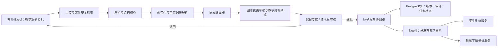

# 开发架构：从教师 DSL 到可发布知识图谱

## 1. 架构原则

系统采用“教学创作层—语义编译层—图谱治理层”三级架构。Excel 是教学意图的源输入，PostgreSQL 保存导入任务、原始版本、审核和发布状态，Neo4j 保存经审核的语义关系；二者职责不同，不把 Neo4j 当作业务事务数据库。



## 2. 模块划分

建议在后端新增独立 `knowledge_graph` 业务模块，不侵入现有训练状态机：

```text
apps/api/app/modules/knowledge_graph/
  router.py                 # 上传、校验、预览、审核、发布接口
  schemas.py                # Pydantic 输入输出模型
  import_service.py         # 导入用例编排
  review_service.py         # 审核与变更决策
  publication_service.py    # 发布与回滚
  import_repository.py      # PostgreSQL 导入任务和版本记录
  graph_repository.py       # 图谱读写边界
  compiler/
    workbook_parser.py      # 读取教师 DSL，不含业务判断
    validators.py           # 结构与教学完整性校验
    normalizers.py          # 空白、标点、枚举、外贸术语规范化
    vocabulary_resolver.py  # 审定词表、别名和消歧
    semantic_compiler.py    # DSL → 内部语义对象与关系
    diff_builder.py         # 与当前发布版计算变更集
  policies.py               # 权限、发布门槛和审核规则
```

前端建议采用两个分离入口：

```text
apps/web/src/features/knowledge-graph/
  teacher-import/           # 模板下载、上传、错误定位、教学预览
  expert-review/            # 关系差异、冲突处理、发布与回滚
  shared/                   # 只公开稳定类型和 API
```

教师页默认不渲染大图，先呈现“案例—局面—策略—提示—评价—结果”的教学链。专家页才提供局部图谱和变更影响范围。

## 3. 编译管线

| 阶段 | 输入 | 输出 | 失败处理 |
|---|---|---|---|
| 文件接收 | `.xlsx` | 文件摘要、哈希、模板版本 | 拒绝宏、超限、损坏文件 |
| 解析 | 工作表与单元格 | `TeacherCaseDraft` | 精确返回工作表/行/列 |
| 结构校验 | 草稿对象 | 错误、警告、建议 | 阻断项不进入编译 |
| 规范化 | 文本与枚举 | 标准训练方式、术语、标点 | 保留原文与规范值 |
| 词表解析 | 教师标题与说明 | 已复用概念、候选新概念 | 低置信度进入人工确认 |
| 语义编译 | 完整案例 | 内部节点、关系和来源锚点 | 规则版本写入变更集 |
| 差异计算 | 草稿与已发布版 | 新增、修改、复用、冲突 | 不直接写 Neo4j |
| 审核 | 变更集 | 审核决定 | 所有决定留审计记录 |
| 发布 | 已批准变更集 | 新图谱版本 | 原子切换或整体回滚 |

## 4. DSL 到图谱的自动映射

| 教师工作表 | 自动生成的主要语义 | 典型关系 | 规则性质 |
|---|---|---|---|
| 案例总表 | Scenario、Role、Goal、BusinessContext | HAS_ROLE、HAS_GOAL、HAS_CONTEXT | 确定性 |
| 关键局面 | Phenomenon、Cue、Risk | EXPOSES、HAS_CUE、MAY_CAUSE | 确定性 + 词表解析 |
| 应对策略 | NegotiationStrategy、Tactic | ADDRESSES、APPLICABLE_WHEN、AVOIDS | 确定性 |
| 知识与材料 | Terminology、Rule、DocumentKnowledge、Resource | REQUIRES、EXPLAINS、PROVIDES | 类型映射 + 词表复用 |
| 分级提示 | Scaffold、Trigger、WithdrawalCondition | SUPPORTS、TRIGGERED_BY、WITHDRAWN_WHEN | 确定性 |
| 评价量规 | RubricDimension、Competency、EvidenceRule | ASSESSES、REQUIRES_EVIDENCE | 词表解析 + 专家确认 |
| 结果与复盘 | NegotiationOutcome、ReflectionPrompt | MAY_LEAD_TO、REFLECTS_ON | 确定性 |

教师使用的编号只负责工作簿内引用。例如 `CASE-001` 与 `S1` 不直接成为全局图谱 ID。系统使用 `组织 + 课程版本 + 案例编号 + 对象类型 + 局部编号` 生成稳定内部键，并在发布前检查碰撞。

## 5. 词表、消歧与 LLM 边界

- 审定词表包含规范名称、别名、类型、定义、适用课程版本和审核状态。
- 精确别名命中可自动复用；同名异义、跨类型命中和低相似度候选必须人工确认。
- LLM 可对自由文本提出“可能关联的既有概念、现象类型或能力维度”，同时给出理由和置信度。
- LLM 输出必须通过 Pydantic Schema 校验，只进入候选区，不能直接生成已发布关系。
- 所有 LLM 调用记录 provider、model、prompt version、correlation ID 和候选结果，不记录完整敏感对话。

## 6. 数据存储边界

### PostgreSQL

保存 `ImportJob`、`WorkbookAsset`、`TemplateVersion`、`TeacherCaseDraft`、`ValidationIssue`、`GraphChangeSet`、`ReviewDecision`、`Publication` 和 `AuditEvent`。这是任务状态、权限、审计和版本的权威来源。

### Neo4j

只保存已批准或明确标记为草稿的语义实体与关系。所有实体带 `stable_key`、`graph_version`、`publication_status`、`source_anchor_id`，但这些字段不暴露给教师。

### 文件存储

原始工作簿以不可变对象保存，记录 SHA-256。预览和校验报告与导入任务关联，便于复盘和合规审计。

## 7. 发布一致性

不依赖跨数据库分布式事务。采用可补偿发布流程：

1. PostgreSQL 锁定已批准变更集并创建 `publishing` 记录。
2. Neo4j 在新 `graph_version` 下幂等写入，尚不切换活动版本。
3. 执行引用完整性、数量、唯一性和抽样语义检查。
4. PostgreSQL 将活动图谱版本原子切换到新版本。
5. 失败则标记发布失败并删除或隔离未激活版本，训练仍读取上一稳定版本。

## 8. API 草案

```text
GET  /api/v1/knowledge-graph/templates/teacher-case/latest
POST /api/v1/knowledge-graph/imports
GET  /api/v1/knowledge-graph/imports/{import_id}
GET  /api/v1/knowledge-graph/imports/{import_id}/issues
GET  /api/v1/knowledge-graph/imports/{import_id}/teaching-preview
GET  /api/v1/knowledge-graph/imports/{import_id}/change-set
POST /api/v1/knowledge-graph/change-sets/{change_set_id}/submit-review
POST /api/v1/knowledge-graph/reviews/{review_id}/decisions
POST /api/v1/knowledge-graph/change-sets/{change_set_id}/publish
POST /api/v1/knowledge-graph/publications/{publication_id}/rollback
GET  /api/v1/knowledge-graph/vocabulary/search
```

导入状态建议为：`uploaded → validating → validation_failed | compiling → review_ready → in_review → approved | rejected → publishing → published | publication_failed → rolled_back`。

## 9. 测试策略

- 解析器：合并单元格、空行、不同 Excel 软件导出、超长文本、公式与恶意外链。
- 校验器：重复编号、失效引用、权重不为 100%、缺撤除标准、结果无条件。
- 编译器：相同输入产生相同变更集；规则版本变化可解释。
- 词表：别名复用、同名异义、跨类型冲突、低置信度人工队列。
- 发布：重复发布幂等、Neo4j 中途失败、上一版本可用、回滚一致。
- 权限：教师不能发布，专家不能越权审核其他课程，技术员操作全审计。
- 端到端：教师上传一个案例，专家批准，学生训练命中提示，教师看到能力证据。
