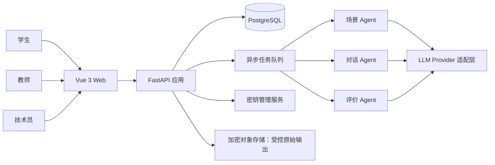

# 阶段 0：只读审计与架构确认

> 状态：待用户确认，禁止进入业务编码
> 审计日期：2026-07-14（Asia/Shanghai）
> 唯一旧资产：本地提供的 `levels.py`
> 源文件 SHA-256：`2dbcdca5528b8885ee799b3fdecec8d6aa4d01def9fc6b0f62b09e0501823ea5`

## 1. 结论先行

新系统应按绿地项目建设。`levels.py` 只迁移课程路线、贯穿案例、学生任务、知识点、场景简报、角色提示和评价意图；不作为运行时依赖，不继承其中的 Python 组织方式，也不据此推测旧系统架构。

阶段 0 发现三个必须先确认的规格差异：

1. 工单写“迁移 34 个小节”，当前文件实际只有 **9 个章节、20 个小节**。
2. 工单要求首期支持谈判对话、商务邮件、文本/单证审阅三种模式；源文件明确写明 **20 关全部为聊天模式**，`mode` 也全部为空字符串。
3. 工单要求场景生成 Agent 为每次训练生成具体实战场景；源文件当前使用 **学生可见固定场景 JSON**，并强调同一贯穿案例与锁定成交事实。

建议的处理基线是：首期按当前可证实的 20 小节建课程版本 `v1`；由教学负责人确认本文件是否为完整源；训练模式按教学任务语义重新映射，但 P0 的难度选项只设 `standard`；场景 Agent 在不可变模板与案例约束内生成“本次 Attempt 场景快照”，刷新页面只读取快照，不再次生成。

## 2. 审计边界

### 2.1 可以证实的内容

| 类别           | `levels.py` 中的证据                                                                     |
| -------------- | ---------------------------------------------------------------------------------------- |
| 课程路线       | `CHAPTERS` 包含 `chapter-0` 至 `chapter-8`，共 20 个 `SectionConfig`                     |
| 贯穿案例       | 新加坡卖方 NovaTech 与中国买方上海翰霖围绕 800 件 NT-IM250 交易推进                      |
| 学生可见场景   | 每关包含场景摘要、学生任务、双方角色、产品、市场、时间、物流、目标、清单、知识点、开场语 |
| AI 对手行为    | 全局 David Lim 人格、强硬但可教学的谈判策略、本关脚本、隐藏底牌                          |
| 评价意图       | 每关含统一五类评价关注点、本关重点和文字化通关条件                                       |
| 连贯性         | 从 3-3 开始注入锁定成交事实，共 13 个小节继承已成交条件                                  |
| 谈判标记       | 20 个小节中 13 个 `expects_bargaining=True`                                              |
| 场景再生成资产 | 20 条 `LEVEL_GENERATION_BRIEFS` 和一个场景 JSON 生成提示词                               |
| 辅助能力       | 章节索引与场景字段扁平化函数                                                             |

### 2.2 不能从唯一旧资产证实的内容

以下内容不是“旧系统功能清单”，只能作为新系统需求重新设计：

- 是否存在登录、用户、班级、教师端或技术员端。
- 是否存在数据库、Attempt、消息、评价、进度或历史记录。
- 是否存在 API、SSE、自动保存、异步任务、重试或幂等机制。
- 是否存在 Vue、原生 JS、Python Web 框架或部署设施。
- 是否曾实际使用三个独立 Agent、三个 API Key 或指定模型。
- 是否有 34 个小节的其他课程来源。

因此，本阶段的“旧系统功能清单”准确说是“`levels.py` 可迁移教学资产清单”。对旧代码质量、旧权限和旧数据不能做没有证据的结论。

## 3. P0 / P1 / P2 范围基线

### 3.1 P0：只交付教学闭环

| 业务域     | P0 内容                                                | 完成证据                         |
| ---------- | ------------------------------------------------------ | -------------------------------- |
| 身份与权限 | 学生、教师、技术员登录；后端强制 RBAC                  | 越权接口测试通过                 |
| 教学组织   | 班级、学生、成员关系                                   | 教师只能访问授权班级             |
| 课程       | 已发布课程版本、章节、小节、先修、排序、模板和量规绑定 | 课程引用校验通过                 |
| 训练       | 场景生成、三种工作台、草稿、恢复、消息、明确提交       | 刷新可恢复，提交后内容冻结       |
| 三 Agent   | 场景、对话、评价三个独立用途配置和独立密钥引用         | 任一密钥不可跨用途调用           |
| 评价       | 提交后异步评价、结构化维度、证据引用、失败重试         | Schema、证据和分数一致性校验通过 |
| 进度       | 只由成功完成的 Attempt 形成                            | `completed` 前不增加完成数       |
| 学生端     | 路线、继续训练、历史、评价                             | 关键闭环 E2E 通过                |
| 教师端     | 班级总览、筛选、学生详情、完整回放、薄弱点             | 每个结论可下钻到 Attempt 证据    |
| 技术员端   | 三 Agent 模型参数、密钥写入/轮换、连通性测试、启停     | 密钥永不回显，变更有审计         |
| 质量       | 单元、接口、关键 E2E；加载/空/错/重试                  | CI 质量门全部通过                |

### 3.2 P1：在 P0 闭环稳定后进入

- 教师布置任务、截止日期和提交状态。
- 课程、场景蓝图、量规的可视化编辑与发布。
- Excel 名册批量导入。
- 更丰富但可解释的班级趋势分析。

### 3.3 P2：明确不进入 P0 模型和主线

- Neo4j、教材自动拆解、复杂 RAG、多路召回。
- 语音识别、语音合成、实时语音通话。
- 批量知识图谱工具、高级推荐、装饰性大屏。

P0 只允许为这些能力保留稳定边界，例如 `KnowledgeProvider` 或 `MediaAttachment` 的设计备注；不建表、不建页面、不建空模块。

## 4. 架构原则与关键决策

### 4.1 系统边界



- 首期采用**模块化单体 + 独立异步 Worker**，不拆微服务。业务边界清晰，但避免过早引入分布式复杂度。
- PostgreSQL 是业务事实来源；异步队列负责 LLM 长任务；SSE 只是投递通道，不是事实来源。
- 三个 Agent 共享 provider 适配协议，但拥有独立的用途配置、密钥引用、模型参数、限流和调用审计。
- 课程、提示词、量规、训练模板均采用“草稿可改、发布后不可变、新版本替代旧版本”。
- Attempt 在创建时绑定具体版本与场景快照，后续课程发布不改变历史证据。
- 权限、解锁、完成和进度全部由确定性代码与数据库约束决定，不能由 LLM 决定。

### 4.2 推荐技术基线

| 层             | 推荐                                              | 说明                                      |
| -------------- | ------------------------------------------------- | ----------------------------------------- |
| Web            | Vue 3、TypeScript strict、Vite、Vue Router、Pinia | 全部可视组件为 `.vue` SFC                 |
| Web 服务器数据 | feature API client + query/cache composable       | 不把所有服务器数据塞入 Pinia              |
| API            | FastAPI、Pydantic、SQLAlchemy 2                   | 路由只编排鉴权/输入/用例/输出             |
| 数据库         | PostgreSQL                                        | 约束、JSONB 快照、事务和并发能力更适合 P0 |
| 迁移           | Alembic                                           | 只允许可审查迁移                          |
| 异步任务       | 独立 Worker + 可持久化队列                        | 具体实现于阶段 1 ADR 决定                 |
| 流式协议       | SSE                                               | 稳定事件名、事件 ID、断线续传             |
| 密钥           | 生产环境外部 Secret Manager；本地 `.env` 仅开发   | 数据库只保存 `secret_ref`，不保存明文     |
| 测试           | Pytest、Vitest、Vue Test Utils、Playwright        | 覆盖权限、状态机、流式和端到端闭环        |

“DeepSeek 4 Flash API”作为部署配置项，不写死在领域层。其准确 provider/model 标识、结构化输出和流式能力需在阶段 1 用供应商文档与真实连通性测试确认。

## 5. 新工程目录

```text
/
├── apps/
│   ├── api/
│   │   ├── alembic/
│   │   ├── app/
│   │   │   ├── main.py
│   │   │   ├── core/                 # config/security/errors/logging
│   │   │   ├── db/                   # base/session/uow
│   │   │   ├── modules/
│   │   │   │   ├── auth/
│   │   │   │   ├── classrooms/
│   │   │   │   ├── curriculum/
│   │   │   │   ├── training/
│   │   │   │   ├── assessment/
│   │   │   │   ├── progress/
│   │   │   │   ├── teacher_analytics/
│   │   │   │   └── technician_config/
│   │   │   ├── integrations/
│   │   │   │   ├── llm/              # provider/renderer/schema/usage
│   │   │   │   ├── secrets/
│   │   │   │   ├── streaming/
│   │   │   │   └── task_queue/
│   │   │   └── workers/
│   │   └── tests/
│   └── web/
│       ├── src/
│       │   ├── app/                   # App/router/providers/layouts
│       │   ├── shared/                # api/components/types/utils/styles
│       │   ├── features/
│       │   │   ├── auth/
│       │   │   ├── curriculum/
│       │   │   ├── training/
│       │   │   ├── evaluation/
│       │   │   ├── progress/
│       │   │   ├── teacher-dashboard/
│       │   │   ├── student-detail/
│       │   │   └── technician-config/
│       │   └── pages/                 # student/teacher/technician
│       └── tests/
├── content/
│   ├── curriculum/
│   │   ├── course.yaml
│   │   └── chapters/
│   ├── training-templates/
│   ├── prompts/
│   │   ├── scenario/
│   │   ├── conversation/
│   │   └── evaluation/
│   └── rubrics/
├── packages/
│   └── api-contract/                  # 从 OpenAPI 生成的 TS 客户端/类型
├── docs/
│   ├── architecture/
│   ├── api/
│   ├── operations/
│   └── decisions/
├── tests/
│   └── e2e/
└── infra/                             # 仅在阶段 1 按部署方案建立
```

目录是职责地图，不是空文件清单。阶段 1 只创建真实被最小登录闭环使用的模块。

## 6. 推荐的阶段 2 纵向切片

推荐 `chapter-3-section-1`“价格还盘攻防”。它是课程标记的核心博弈，能验证场景生成、对话、消息留存、提交冻结、结构化评价、进度与教师回放，并能有效测试隐藏底牌不泄漏。

这一选择的局限是不能单独证明邮件和单证审阅工作台。解决方式不是扩大阶段 2，而是在阶段 3 批量迁移前增加两个“模式适配验收样例”：`chapter-0-section-1` 用邮件工作台、`chapter-6-section-1` 用单证审阅工作台。它们只验证模式组件，不另起完整产品主线。

## 7. 阶段 0 决策门

进入阶段 1 前需确认：

1. 以当前 20 小节作为首个课程版本，还是另有包含 34 小节的权威文件。
2. 是否接受按教学任务把源文件的“全聊天模式”重映射为三种训练模式。
3. 是否接受“模板约束下生成一次并固化快照”，取代源文件的全局固定场景。
4. 是否接受 `chapter-3-section-1` 为阶段 2 单条纵向切片。
5. 三个 Agent 的实际 provider/model 标识、账户配额和三个独立密钥是否已具备。
6. P0 部署环境、数据库和 Secret Manager 的归属人；本设计默认生产 PostgreSQL，密钥不落业务库。

未确认前，只允许继续补充阶段 0 文档或做原型验证，不允许开始业务实现。

## 8. 本阶段交付索引

- [课程路线迁移清单](./curriculum-migration.md)
- [领域模型、ER 图与 Attempt 状态机](./domain-model-and-state.md)
- [API 契约与页面地图](./api-and-page-map.md)
- [风险、迁移回滚与阶段验收](./delivery-risks-and-rollback.md)
