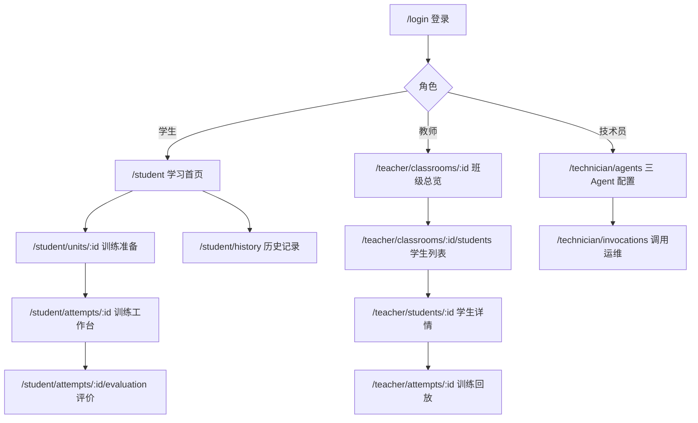

# API 契约草案与页面地图

## 1. 契约规则

- 基础路径：`/api/v1`；JSON 字段统一 `snake_case`。
- 身份认证：P0 建议短期 Access Token + 可撤销 Refresh Session；Token 放安全 Cookie 或 `Authorization`，阶段 1 ADR 按部署拓扑确定。
- 所有写操作接收 `X-Request-Id`；创建、提交、重试等操作必须接收 `Idempotency-Key`。
- 时间为带时区 ISO 8601 UTC，展示时由前端本地化。
- ID 为不透明 UUID；客户端不得解析 ID 表达业务含义。
- 列表使用游标分页：`items`, `next_cursor`, `has_more`。
- 并发编辑使用 `revision`/`If-Match`，冲突返回 409。
- 错误使用稳定代码，不让前端依赖供应商错误文本。

统一错误：

```json
{
  "error": {
    "code": "attempt.invalid_transition",
    "message": "当前训练状态不能提交。",
    "details": { "current_status": "evaluating" },
    "request_id": "01J...",
    "retryable": false
  }
}
```

核心状态码：400 输入语义错误，401 未认证，403 越权，404 不可见或不存在，409 状态/并发/幂等冲突，422 Schema 错误，429 限流，502 provider 错误，503 临时不可用。

## 2. API 资源清单

### 2.1 认证

| 方法与路径           | 角色       | 用途                 | 关键结果                                 |
| -------------------- | ---------- | -------------------- | ---------------------------------------- |
| `POST /auth/login`   | 公开       | 邮箱/学号 + 密码登录 | 用户摘要、角色、会话；统一失败文本防枚举 |
| `POST /auth/refresh` | 已登录会话 | 轮换 access/refresh  | 旧 refresh 立即失效                      |
| `POST /auth/logout`  | 已登录     | 撤销当前会话         | 204，幂等                                |
| `GET /me`            | 已登录     | 当前身份与能力       | 不返回敏感配置                           |

### 2.2 学生课程与训练

| 方法与路径                                     | 角色          | 用途                                   | 幂等/状态规则                              |
| ---------------------------------------------- | ------------- | -------------------------------------- | ------------------------------------------ |
| `GET /courses/current/map`                     | 学生          | 当前课程路线与每节状态                 | 状态由服务器计算                           |
| `GET /units/{unit_id}`                         | 学生          | 准备页信息、目标、时长、模式、评价维度 | 隐藏提示和底牌不返回                       |
| `POST /attempts`                               | 学生          | 为小节创建或恢复 Attempt               | 必须有幂等键；先修不满足返回 403           |
| `GET /attempts/{attempt_id}`                   | 本人          | 恢复完整工作台状态                     | 只返回本人或授权教师可见内容               |
| `PUT /attempts/{attempt_id}/draft`             | 本人          | 自动保存模式草稿                       | 使用 `revision` 乐观锁；仅 `in_progress`   |
| `POST /attempts/{attempt_id}/messages`         | 本人          | 保存学生消息并触发对话 Agent           | `client_message_id` 幂等；仅 `in_progress` |
| `GET /attempts/{attempt_id}/events`            | 本人          | SSE 场景/消息/评价事件                 | 支持 `Last-Event-ID` 和断线续传            |
| `POST /attempts/{attempt_id}/submit`           | 本人          | 明确确认后正式提交                     | 每 Attempt 单一 Submission；冻结正文       |
| `POST /attempts/{attempt_id}/evaluation-retry` | 本人/授权教师 | 对失败评价显式重试                     | 仅 `evaluation_failed`；新增 run           |
| `POST /attempts/{attempt_id}/retry`            | 本人          | 从已完成记录创建重练                   | 新建 Attempt，保留原证据                   |
| `GET /me/progress`                             | 学生          | 总览、章节、小节和能力摘要             | 只统计完成事实                             |
| `GET /me/attempts`                             | 学生          | 历史训练记录                           | 支持状态/小节/时间筛选                     |

创建 Attempt 请求：

```json
{
  "unit_id": "chapter-3-section-1",
  "difficulty": "standard"
}
```

返回 `202 Accepted`：

```json
{
  "attempt_id": "uuid",
  "status": "generating_scenario",
  "course_version": "1.0.0",
  "unit": {
    "id": "chapter-3-section-1",
    "title": "价格还盘攻防",
    "training_mode": "negotiation"
  },
  "events_url": "/api/v1/attempts/uuid/events",
  "created_at": "2026-07-14T02:00:00Z"
}
```

消息请求先持久化学生输入，返回 `202 Accepted`：

```json
{
  "client_message_id": "019...",
  "content": "Dear Mr. Lim, ..."
}
```

```json
{
  "student_message": {
    "id": "uuid",
    "status": "completed",
    "sequence_no": 3
  },
  "assistant_message": {
    "id": "uuid",
    "status": "pending",
    "sequence_no": 4
  }
}
```

正式提交必须携带用户在确认对话框中看到的 revision：

```json
{
  "confirmed": true,
  "expected_revision": 12
}
```

如果内容在确认后被其他标签页修改，返回 `409 attempt.revision_conflict`，不能静默提交不同内容。

### 2.3 教师

| 方法与路径                                    | 用途                                     | 查询/权限                                                                  |
| --------------------------------------------- | ---------------------------------------- | -------------------------------------------------------------------------- |
| `GET /teacher/classrooms`                     | 教师可访问班级                           | 只按明确教师关系授权                                                       |
| `GET /teacher/classrooms/{id}/overview`       | 指标、章节分布、动态、共性薄弱、关注学生 | 支持时间窗口；返回指标定义                                                 |
| `GET /teacher/classrooms/{id}/students`       | 学生列表                                 | `q`, `chapter_id`, `completion_band`, `activity`, `risk`, `sort`, `cursor` |
| `GET /teacher/students/{student_id}/progress` | 学生概览、路线、时间线、维度和历史       | 必须与教师授权班级有有效关系                                               |
| `GET /teacher/attempts/{attempt_id}`          | 完整训练回放                             | 场景、任务、消息、提交、评价、证据、版本                                   |

班级总览指标必须返回 `value`、`definition`、`window_start`、`window_end`、`sample_size`，避免前后端对“活跃”“平均分”各自解释。

学生列表建议响应字段：

```json
{
  "items": [
    {
      "student": { "id": "uuid", "student_no": "2026001", "name": "陈同学" },
      "current_progress": {
        "chapter_title": "还盘",
        "unit_title": "价格还盘攻防"
      },
      "completed_units": 5,
      "total_units": 20,
      "completion_rate": 0.25,
      "latest_score": 78,
      "last_active_at": "2026-07-13T08:00:00Z",
      "status": "active",
      "risk_reasons": [
        { "code": "two_low_scores", "label": "连续两次评价低于 60 分" }
      ]
    }
  ],
  "next_cursor": null,
  "has_more": false
}
```

### 2.4 技术员

| 方法与路径                                            | 用途                                   | 安全规则                                    |
| ----------------------------------------------------- | -------------------------------------- | ------------------------------------------- |
| `GET /technician/agent-configurations`                | 查看三用途当前配置和版本               | 只返回密钥指纹/更新时间，不返回密钥         |
| `POST /technician/secrets`                            | 写入或轮换一个用途的密钥               | 明文只在请求处理内短暂存在；响应不回显      |
| `POST /technician/agent-configurations`               | 创建配置草稿版本                       | provider/model/参数/超时/重试需 Schema 校验 |
| `POST /technician/agent-configurations/{id}/test`     | 小型连通性与结构化输出测试             | 显式触发，有审计和严格用量上限              |
| `POST /technician/agent-configurations/{id}/activate` | 激活已测试配置                         | 同用途旧配置原子失活；写审计事件            |
| `GET /technician/llm-invocations`                     | 查看去敏调用状态、用量、延迟和错误分类 | 不返回完整提示、对话、密钥或原始响应        |

权限上，技术员不能因此获得班级/学生对话查看权；教师也不能查看模型密钥。角色是分权而不是“后台管理员万能权限”。

## 3. SSE 事件契约

连接：`GET /api/v1/attempts/{attempt_id}/events`，响应 `text/event-stream`。每个事件都有单调递增的 `id`，客户端重连时发送 `Last-Event-ID`。

```text
id: 184
event: message.delta
data: {"schema_version":"1","attempt_id":"...","entity_id":"message-id","sequence":12,"delta":"Thank you","occurred_at":"..."}
```

稳定事件类型：

| 事件                   | 最小字段                                   | 终态行为                       |
| ---------------------- | ------------------------------------------ | ------------------------------ |
| `message.started`      | `message_id`, `sequence_no`                | 建立占位消息                   |
| `message.delta`        | `message_id`, `sequence`, `delta`          | 按 sequence 追加，重复片段去重 |
| `message.completed`    | `message_id`, `content_hash`               | 以服务端最终消息替换流式缓存   |
| `message.failed`       | `message_id`, `error.code`, `retryable`    | 保留学生输入，显示重试         |
| `evaluation.started`   | `evaluation_id`, `run_no`                  | 显示评价进行中                 |
| `evaluation.completed` | `evaluation_id`, `result_url`              | 拉取正式评价资源               |
| `evaluation.failed`    | `evaluation_id`, `error.code`, `retryable` | 显示显式评价重试               |
| `stream.closed`        | `reason`, `last_event_id`                  | 正常关闭或提示重连             |

场景生成补充两个对称事件：`scenario.started/completed/failed`。这是工单所列稳定类型的必要扩展，否则创建 Attempt 后无法可靠表达场景任务状态。

规则：

- `delta` 只用于即时体验，最终事实必须由 `message.completed` 后的 GET 资源确认。
- SSE 事件数据不包含隐藏场景、系统提示、底牌、密钥或供应商原始错误。
- 客户端发现 sequence 缺口时停止拼接并重新拉取 Attempt，不猜测缺失内容。

## 4. 角色访问矩阵

| 资源/操作              |           学生 |             教师 |               技术员 |
| ---------------------- | -------------: | ---------------: | -------------------: |
| 查看当前课程公开内容   |           自己 |     授权班级课程 |                   否 |
| 创建/编辑/提交 Attempt |           自己 |               否 |                   否 |
| 查看训练回放           |           自己 |     授权班级学生 |                   否 |
| 重试评价               | 自己的失败评价 | 授权学生失败评价 |                   否 |
| 查看个人进度           |           自己 |         授权学生 |                   否 |
| 查看班级分析           |             否 |         授权班级 |                   否 |
| 配置三 Agent           |             否 |               否 |                   是 |
| 查看 API Key 明文      |             否 |               否 | 否（写入后也不回显） |
| 查看去敏 LLM 运维记录  |             否 |               否 |                   是 |

## 5. 页面地图



路由守卫只负责改善体验；每个 API 仍必须独立鉴权。登录后有多个角色时显示明确的工作区切换，不自动把技术员当教师。

## 6. 页面与组件边界

### 6.1 学生

| 页面                          | 只负责组合的 feature 组件                                                                           | 数据入口                                           |
| ----------------------------- | --------------------------------------------------------------------------------------------------- | -------------------------------------------------- |
| `StudentHomePage.vue`         | `CourseProgressHeader`, `ChapterRoadmap`, `ContinueAttempt`, `RecentFeedback`, `NextRecommendation` | `features/curriculum/api`, `features/progress/api` |
| `TrainingPreparationPage.vue` | `LearningObjectives`, `ScenarioPreview`, `RoleBrief`, `RubricPreview`, `StartTrainingAction`        | `features/curriculum/api`                          |
| `TrainingWorkspacePage.vue`   | `ScenarioBrief`, 模式 Workspace, `TrainingChecklist`, `AutosaveIndicator`, `SubmitAttemptDialog`    | `features/training/composables/useAttemptSession`  |
| `AttemptEvaluationPage.vue`   | `EvaluationSummary`, `DimensionResults`, `EvidenceList`, `NextActions`, `RetryOrContinue`           | `features/evaluation/api`                          |
| `AttemptHistoryPage.vue`      | `AttemptFilters`, `AttemptHistoryList`, `AttemptStatus`                                             | `features/training/api`                            |

模式组件：

- `NegotiationWorkspace.vue` 组合时间线和消息输入。
- `EmailWorkspace.vue` 组合收件信息、主题、正文编辑和预览。
- `DocumentReviewWorkspace.vue` 组合原文、批注/发现项和结论区。

三者共同依赖公开的 `AttemptWorkspaceContract`，不得互相导入内部实现。页面中不出现 `if mode === ...` 后塞入三套完整流程；由模式注册表选择组件。

### 6.2 教师

| 页面     | 核心组件                                                                                                                        |
| -------- | ------------------------------------------------------------------------------------------------------------------------------- |
| 班级总览 | `OverviewMetrics`, `ChapterCompletionDistribution`, `RecentActivity`, `WeakDimensions`, `StudentsNeedingAttention`              |
| 学生列表 | `StudentFilters`, `StudentTable`, `RiskReasonList`, `PaginationControls`                                                        |
| 学生详情 | `LearningOverview`, `RouteCompletion`, `TrainingTimeline`, `DimensionTrend`, `WeakSkills`, `AttemptList`                        |
| 训练回放 | `ScenarioSnapshotPanel`, `SubmissionReplay`, `ConversationReplay`, `EvaluationDimensions`, `EvidenceTrace`, `VersionProvenance` |

### 6.3 技术员

| 页面       | 核心组件                                                                                                        |
| ---------- | --------------------------------------------------------------------------------------------------------------- |
| Agent 配置 | `AgentPurposeTabs`, `ProviderModelForm`, `SecretRotationForm`, `ConnectivityTestResult`, `ConfigurationHistory` |
| 调用运维   | `InvocationFilters`, `UsageSummary`, `InvocationTable`, `ErrorCategoryBreakdown`                                |

## 7. 关键交互状态

所有页面至少实现：初始加载、慢加载、空状态、权限失败、可重试错误、不可重试错误、成功反馈。训练页额外实现：

- 场景生成中/失败/重试。
- 自动保存等待/进行中/成功/冲突/失败。
- 消息排队/流式/完成/失败。
- SSE 断开/重连/转为轮询恢复。
- 提交确认/提交中/已提交防重复。
- 评价中/失败/显式重试/完成。

常见笔记本宽度下训练工作台不横向滚动。移动端按“场景抽屉 → 主工作区 → 任务抽屉”降级，保留路线、对话和评价主流程；教师复杂分析可在移动端只读简化。
