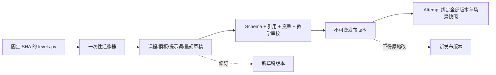

# 课程路线迁移清单

## 1. 源资产基线

本清单只基于 SHA-256 为 `2dbcdca5528b8885ee799b3fdecec8d6aa4d01def9fc6b0f62b09e0501823ea5` 的 `levels.py`。

| 统计项           |                           结果 |
| ---------------- | -----------------------------: |
| 章节             |                              9 |
| 小节             |                             20 |
| 标记为谈判       |                             13 |
| 注入锁定成交事实 |                             13 |
| 源文件训练模式   | 全部为空，文件说明为全聊天模式 |
| 源文件难度选项   |                             无 |
| 固定学生可见场景 |                             20 |
| 场景再生成简报   |                             20 |

“34 个小节”不能从当前源文件得到。迁移器必须以解析结果为准；在教学负责人提供新权威源之前，禁止伪造缺失的 14 个小节。

## 2. 迁移原则

1. 迁移的是教学意图，不迁移 Python 运行结构。
2. 原 ID 在首个课程版本中保留，作为 `legacy_source_id` 与新 `id`，避免追溯困难。
3. 源文件没有明确给出的字段标为“拟定”，发布前由教学负责人确认。
4. P0 的 `difficulty_options` 统一为 `[standard]`，不凭空制造初级/高级内容差异。
5. 先修关系按当前路线拟定为线性前置；如果允许跳学，应由教学负责人逐节解除，而不是默认为全部开放。
6. 三种 `training_mode` 是新产品语义映射，不声称是源文件原有模式。
7. 每个小节在进入已发布课程版本前，必须绑定已发布的训练模板、三个用途的提示词版本和量规版本。

## 3. 20 小节迁移表

下表的模式、预计时长、先修、模板和量规为阶段 0 建议，发布前待确认。

| 排序 | 小节 ID / 标题                               | 拟定模式          | 拟定先修 | 分钟 | 模板 ID                        | 量规 ID                   |
| ---: | -------------------------------------------- | ----------------- | -------- | ---: | ------------------------------ | ------------------------- |
|    1 | `chapter-0-section-1` 初次接触：索取目录     | `business_email`  | 无       |   20 | `business-relation-email`      | `business-correspondence` |
|    2 | `chapter-1-section-1` 发出具体询盘           | `business_email`  | 0-1      |   20 | `inquiry-email`                | `inquiry-and-offer`       |
|    3 | `chapter-1-section-2` 催询与条件探询         | `business_email`  | 1-1      |   20 | `follow-up-enquiry-email`      | `inquiry-and-offer`       |
|    4 | `chapter-2-section-1` 应对虚盘               | `negotiation`     | 1-2      |   25 | `offer-negotiation`            | `inquiry-and-offer`       |
|    5 | `chapter-2-section-2` 接收实盘并理解其约束力 | `document_review` | 2-1      |   20 | `firm-offer-review`            | `document-review`         |
|    6 | `chapter-3-section-1` 价格还盘攻防           | `negotiation`     | 2-2      |   25 | `price-negotiation`            | `negotiation`             |
|    7 | `chapter-3-section-2` 付款与交期还盘         | `negotiation`     | 3-1      |   25 | `terms-negotiation`            | `negotiation`             |
|    8 | `chapter-3-section-3` 终局博弈               | `negotiation`     | 3-2      |   25 | `conditional-acceptance`       | `negotiation`             |
|    9 | `chapter-4-section-1` 确认成交与销售确认书   | `business_email`  | 3-3      |   20 | `deal-confirmation-email`      | `business-correspondence` |
|   10 | `chapter-4-section-2` 催开信用证             | `business_email`  | 4-1      |   20 | `lc-follow-up-email`           | `payment-and-delivery`    |
|   11 | `chapter-5-section-1` 包装与唛头磋商         | `negotiation`     | 4-2      |   25 | `packing-negotiation`          | `payment-and-delivery`    |
|   12 | `chapter-5-section-2` 分批/转船磋商与催装    | `negotiation`     | 5-1      |   25 | `shipment-negotiation`         | `payment-and-delivery`    |
|   13 | `chapter-6-section-1` 信用证审核与改证       | `document_review` | 5-2      |   30 | `lc-document-review`           | `document-review`         |
|   14 | `chapter-6-section-2` 交单结汇与装运通知     | `document_review` | 6-1      |   25 | `shipping-document-review`     | `document-review`         |
|   15 | `chapter-7-section-1` 检验条款磋商           | `document_review` | 6-2      |   25 | `inspection-clause-review`     | `trade-clauses`           |
|   16 | `chapter-7-section-2` 投保险别磋商           | `negotiation`     | 7-1      |   25 | `insurance-negotiation`        | `trade-clauses`           |
|   17 | `chapter-7-section-3` 仲裁条款磋商           | `document_review` | 7-2      |   25 | `arbitration-clause-review`    | `trade-clauses`           |
|   18 | `chapter-8-section-1` 提出质量索赔           | `business_email`  | 7-3      |   30 | `quality-claim-email`          | `claims-and-settlement`   |
|   19 | `chapter-8-section-2` 应对抗辩，证据反驳     | `negotiation`     | 8-1      |   25 | `claim-defense-negotiation`    | `claims-and-settlement`   |
|   20 | `chapter-8-section-3` 理赔和解               | `negotiation`     | 8-2      |   25 | `claim-settlement-negotiation` | `claims-and-settlement`   |

所有记录拟定为：`version: 1.0.0`、`publication_status: draft`、`difficulty_options: [standard]`。只有内容审校、引用校验和模式验收通过后，才能随 `CourseVersion` 一起发布。

## 4. 小节教学意图与知识标签

| 小节 | 核心学习目标                                          | 建议 `knowledge_tags`                                       |
| ---- | ----------------------------------------------------- | ----------------------------------------------------------- |
| 0-1  | 形成规范建立业务关系函，准确表达来源、请求和合作意愿  | `business-letter`, `7c`, `business-etiquette`               |
| 1-1  | 构成要素完整的具体询盘，同时保留议价信息              | `enquiry`, `cif`, `information-strategy`                    |
| 1-2  | 用有限信息交换推动正式报盘，控制节奏                  | `follow-up`, `information-exchange`, `negotiation-pace`     |
| 2-1  | 识别 `subject to confirmation` 的无约束性质并要求实盘 | `offer`, `non-firm-offer`, `cisg`, `anchoring`              |
| 2-2  | 复核实盘关键要素，理解约束力和有效期                  | `firm-offer`, `validity`, `cisg`, `offer-elements`          |
| 3-1  | 用市场、数量与合作价值进行有依据的价格还盘            | `counter-offer`, `anchoring`, `batna`, `reciprocity`        |
| 3-2  | 从付款和交期维度争取整体利益，理解对手底线            | `payment`, `delivery`, `trade-off`, `lc`                    |
| 3-3  | 使用有条件接受和反建议换取增值并收束交易              | `conditional-acceptance`, `value-creation`, `deal-closing`  |
| 4-1  | 无遗漏复述成交事实并推动销售确认书                    | `deal-confirmation`, `sales-confirmation`, `term-accuracy`  |
| 4-2  | 专业推进开证并理解交期起算                            | `lc-opening`, `follow-up`, `delivery-clock`                 |
| 5-1  | 形成可执行且兼顾成本的包装与唛头要求                  | `packing`, `shipping-mark`, `cost-control`                  |
| 5-2  | 就分批、转船和总交期作出条件明确的回应                | `partial-shipment`, `transshipment`, `shipment`             |
| 6-1  | 识别信用证不符点并区分合理与不合理改证要求            | `lc-review`, `ucp600`, `amendment`, `discrepancy`           |
| 6-2  | 核对装运通知与单据信息并安排接货付款                  | `shipping-notice`, `bill-of-lading`, `document-check`       |
| 7-1  | 构造机构、标准、时限、复验范围明确的检验条款          | `inspection`, `ccic`, `sgs`, `risk-allocation`              |
| 7-2  | 理解 ICC 险别与 CIF 投保义务并协商保费                | `insurance`, `icc`, `incoterms`, `premium`                  |
| 7-3  | 形成机构、地点、规则、效力齐全的仲裁条款              | `arbitration`, `cietac`, `siac`, `new-york-convention`      |
| 8-1  | 用证书、数量、金额和合同条款形成可核验索赔            | `claim`, `evidence-chain`, `insurance-liability`, `quality` |
| 8-2  | 用证据反驳不当抗辩，同时保持专业克制                  | `claim-defense`, `evidence`, `tolerance`, `sampling`        |
| 8-3  | 在现金/非现金方案间实现有实质价值的和解               | `settlement`, `non-cash-remedy`, `win-win`, `closure`       |

## 5. 源字段到新内容资产的拆分

| 源内容                              | 新归属                                | 迁移处理                                      |
| ----------------------------------- | ------------------------------------- | --------------------------------------------- |
| `ChapterConfig`                     | `course.yaml` + `chapters/*.yaml`     | 拆章节与小节，补版本/发布/排序字段            |
| `SectionConfig.title/description`   | `TrainingUnit`                        | 原文保留，教学负责人可在新版本修订            |
| 固定场景 JSON                       | `training-templates/*.yaml`           | 拆为稳定案例事实、可变量、学生可见字段 Schema |
| `LEVEL_GENERATION_BRIEFS`           | 场景提示输入资产                      | 作为蓝图，不直接拼进 Python                   |
| `SCENARIO_GENERATION_SYSTEM_PROMPT` | `prompts/scenario/*.yaml`             | 增加 ID、版本、输入/输出 Schema、变更记录     |
| `GLOBAL_SYSTEM_PROMPT`              | `prompts/conversation/*.yaml`         | 公共人格与小节规则分层组合，服务端专用        |
| 各关 actor 脚本                     | 小节专属 conversation prompt fragment | 明确变量、隐藏字段和适用模式                  |
| `LOCKED_DEAL_FACTS`                 | 贯穿案例事实版本                      | 从 3-3 起绑定，加入一致性校验                 |
| 各关 evaluation prompt              | `rubrics/*.yaml` + evaluation prompt  | 评价维度、权重、硬失败项与提示正文分离        |
| `expects_bargaining`                | 模式参考/模板参数                     | 不直接等于新 `training_mode`                  |
| `mode=""`                           | 不迁移                                | 使用经教学确认的新模式映射                    |
| Python helper                       | 不迁移                                | 由内容加载器、Schema 校验和发布用例取代       |

## 6. 内容版本与发布模型

发布时应生成内容清单 `manifest`，至少记录：

- 课程版本 ID 与语义版本号。
- 所有章节、小节、模板、提示词、量规的 ID、版本和内容哈希。
- 发布时间、发布人、变更说明。
- 来源文件哈希与迁移器版本。
- 验证报告引用。

## 7. 自动验证要求

迁移和每次发布必须自动检查：

1. 章节、小节 ID 唯一，排序无重复且连续关系可解释。
2. 先修引用存在、无环、不能引用未发布小节。
3. `template_id`、三个用途的 `prompt_template_id`、`rubric_id` 均存在且版本已发布。
4. 提示词声明的输入变量与模板正文一致，不允许未声明变量或缺失变量。
5. 场景输出 Schema 不允许出现 `ai_bottom_line`、成本、BATNA 等服务端隐藏字段。
6. 评价量规维度权重合计为 1，分数边界与总分计算规则一致。
7. 贯穿案例在 3-3 后保持数量、产品、价格、贸易术语、付款、装运和增值事实一致。
8. 每个小节至少有一个学习目标、一个通关规则和一个知识标签。
9. P0 只允许 `negotiation`、`business_email`、`document_review` 三种模式。
10. 内容 YAML 能被 Pydantic Schema 解析，并能完成一次无网络的渲染测试。

## 8. 内容风险与待教学审校项

- 源文件中的 CISG、UCP 600、INCOTERMS 2020、ICC 险别、仲裁和责任切分属于专业教学内容，发布前需要外贸/法律教师逐条审校，模型不能充当权威来源。
- 全局 actor 提示包含成本、价格底线和 BATNA。它必须进入只在服务端渲染的隐藏层，任何学生 API、日志、错误和浏览器 source map 都不能包含这些文本。
- 从 3-3 起的锁定事实与“每次动态生成场景”存在张力。生成器只能改变非核心情境变量，不能改变贯穿交易事实；否则后续课程会自相矛盾。
- 部分源任务本质上是商务函电，却被旧文件统一当聊天。新模式映射需要教学负责人确认，尤其是 2-2、4-1、5-1、7-1、7-3。
- 源评价只有文字化通关条件，没有结构化维度权重。新量规必须由教学负责人确认，不能仅由工程团队从提示词自动推导后直接发布。
