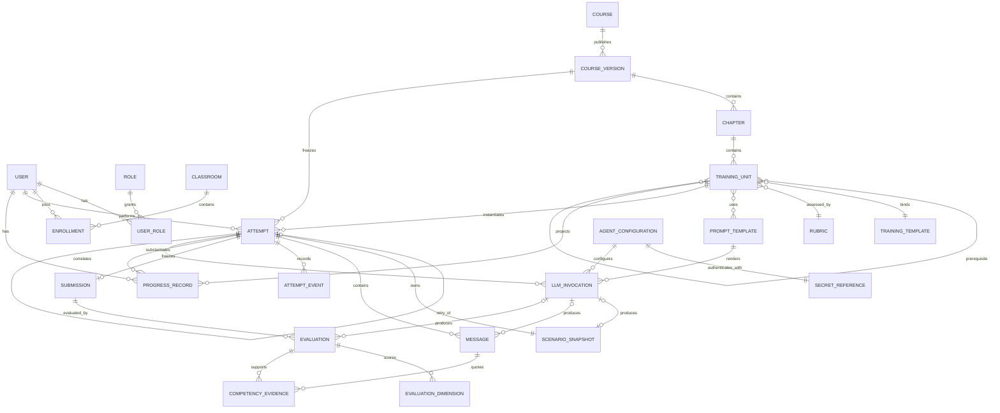
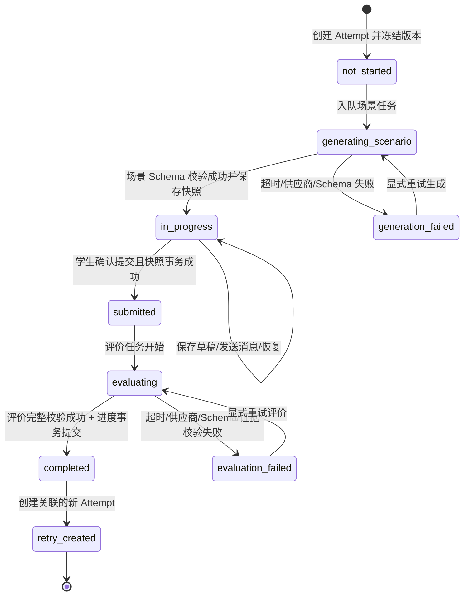
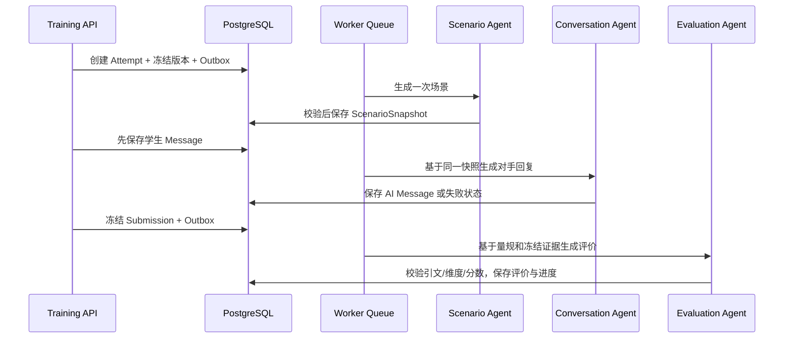

# 领域模型、ER 图与 Attempt 状态机

## 1. 业务模块边界

| 模块                | 拥有的事实                                        | 不负责                 |
| ------------------- | ------------------------------------------------- | ---------------------- |
| `auth`              | 用户身份、密码凭据、角色授权                      | 课程解锁、班级分析     |
| `classrooms`        | 班级、成员关系、教师可见范围                      | 学习进度计算           |
| `curriculum`        | 课程版本、章节、小节、模板/提示词/量规引用        | Attempt 生命周期       |
| `training`          | Attempt、场景快照、消息、草稿、提交、重练         | 评价内容生成、班级聚合 |
| `assessment`        | 评价任务、结构化结果、维度、证据、重试            | 直接修改课程进度       |
| `progress`          | 从成功评价投影出的学生进度                        | 调用 LLM               |
| `teacher_analytics` | 授权范围内的只读聚合和风险规则                    | 另存一套训练事实       |
| `technician_config` | 三 Agent 配置版本、密钥引用、启用状态、连通性检查 | 读取或导出密钥明文     |
| `integrations.llm`  | provider 协议、渲染、结构化校验、用量和错误分类   | 业务状态判定           |

模块之间通过应用用例和公开 Schema 协作，不允许跨模块直接操作对方 repository。

## 2. 核心 ER 图



为可读性，图中把小节先修画成自关联；数据库实现建议使用 `training_unit_prerequisite` 关联表。

## 3. 实体与不可变约束

### 3.1 身份与班级

| 实体         | 关键字段                                                                           | 关键约束                                           |
| ------------ | ---------------------------------------------------------------------------------- | -------------------------------------------------- |
| `User`       | `id`, `email`, `student_no`, `display_name`, `password_hash`, `status`, timestamps | 邮箱唯一；学号可空但学生角色时唯一；密码只存强哈希 |
| `Role`       | `id`, `code`                                                                       | `student/teacher/technician`；角色码唯一           |
| `UserRole`   | `user_id`, `role_id`                                                               | 组合唯一；权限以后端为准                           |
| `Classroom`  | `id`, `name`, `course_id`, `owner_teacher_id`, `status`                            | 教师访问范围由班级关系决定                         |
| `Enrollment` | `id`, `classroom_id`, `student_id`, `status`, `joined_at`, `left_at`               | 同一学生同班有效成员唯一；历史不物理删除           |

P0 默认一个班级一个负责人。需要多教师时增加 `ClassroomStaff`，不复用学生 `Enrollment` 表表达教师关系。

### 3.2 课程与内容

| 实体               | 关键字段                                                                                                          | 关键约束                                                         |
| ------------------ | ----------------------------------------------------------------------------------------------------------------- | ---------------------------------------------------------------- |
| `Course`           | `id`, `code`, `title`, `status`                                                                                   | 稳定课程身份，不承载可变内容                                     |
| `CourseVersion`    | `id`, `course_id`, `version`, `status`, `source_hash`, `manifest_hash`, `published_at`                            | `(course_id, version)` 唯一；发布后不可变                        |
| `Chapter`          | `id`, `course_version_id`, `source_key`, `title`, `sort_order`                                                    | 同版本内 ID、排序唯一                                            |
| `TrainingUnit`     | `id`, `chapter_id`, 用户要求的全部课程字段                                                                        | 已发布记录不可变；模式枚举受限                                   |
| `TrainingTemplate` | `id`, `template_key`, `version`, `mode`, `input_schema`, `body`, `status`                                         | `(template_key, version)` 唯一；发布后不可变                     |
| `PromptTemplate`   | `id`, `prompt_key`, `version`, `purpose`, `input_schema`, `output_schema`, `body`, `mode`, `change_log`, `status` | purpose 仅 `scenario/conversation/evaluation/hint`；发布后不可变 |
| `Rubric`           | `id`, `rubric_key`, `version`, `dimensions`, `hard_fail_rules`, `status`                                          | 维度 key 唯一；权重合计 1；发布后不可变                          |

`TrainingUnit` 不把大段提示正文或量规 JSON 复制进自身，只持明确版本引用。发布 `CourseVersion` 时生成 manifest，确保所有引用闭合。

### 3.3 训练与证据

| 实体               | 关键字段                                                                                                                                                                                   | 关键约束                                                                   |
| ------------------ | ------------------------------------------------------------------------------------------------------------------------------------------------------------------------------------------ | -------------------------------------------------------------------------- |
| `Attempt`          | `id`, `student_id`, `unit_id`, `course_version_id`, `status`, `retry_of_attempt_id`, `content_bindings`, `draft_revision`, `submitted_revision`, `completed_at`, timestamps, `row_version` | 创建时冻结课程/模板/提示词/量规/模型配置版本；状态只能按状态机迁移         |
| `ScenarioSnapshot` | `id`, `attempt_id`, `public_payload`, `private_payload_ref`, `content_hash`, `llm_invocation_id`, `created_at`                                                                             | 每个 Attempt 恰好一个成功快照；生成后不可变；公开/隐藏内容隔离             |
| `Message`          | `id`, `attempt_id`, `sequence_no`, `role`, `content`, `status`, `client_message_id`, `reply_to_id`, timestamps                                                                             | `(attempt_id, sequence_no)` 唯一；学生消息先落库再调用模型；客户端 ID 幂等 |
| `Submission`       | `id`, `attempt_id`, `snapshot_payload`, `conversation_hash`, `idempotency_key`, `submitted_at`                                                                                             | 每个 Attempt 至多一个正式提交；提交内容不可变                              |
| `AttemptEvent`     | `id`, `attempt_id`, `event_type`, `from_status`, `to_status`, `actor_id`, `correlation_id`, `occurred_at`, `metadata`                                                                      | 仅追加；不含密钥和完整敏感对话                                             |

`content_bindings` 必须能明确还原：课程版本、小节版本、训练模板版本、场景/对话/评价提示词版本、量规版本、三个 Agent 配置版本。可以用结构化列或受 Schema 约束的 JSONB，但不能只存一个模糊字符串。

### 3.4 评价与进度

| 实体                  | 关键字段                                                                                                                                                                                                                          | 关键约束                                                    |
| --------------------- | --------------------------------------------------------------------------------------------------------------------------------------------------------------------------------------------------------------------------------- | ----------------------------------------------------------- |
| `Evaluation`          | `id`, `attempt_id`, `submission_id`, `run_no`, `status`, `overall_score`, `level`, `summary`, `strengths`, `improvements`, `next_actions`, `knowledge_tags`, `model_name`, `prompt_version`, `raw_output_reference`, `created_at` | 重试创建新 run，不覆盖失败/旧结果；只有一个 active 成功结果 |
| `EvaluationDimension` | `id`, `evaluation_id`, `dimension_key`, `score`, `max_score`, `weight`, `comment`                                                                                                                                                 | 维度来自绑定量规；分数边界有效；权重一致                    |
| `CompetencyEvidence`  | `id`, `evaluation_id`, `dimension_key`, `message_id`, `quote`, `start_offset`, `end_offset`, `reason`                                                                                                                             | 引文必须是对应学生消息的精确子串，校验失败则整次评价失败    |
| `ProgressRecord`      | `id`, `student_id`, `course_version_id`, `unit_id`, `completed_attempt_id`, `first_completed_at`, `latest_completed_at`, `best_score`, `latest_score`                                                                             | 确定性投影；唯一键为学生+课程版本+小节；不由 LLM 直接写入   |

总体分由服务端根据 `EvaluationDimension.score × weight` 计算并落库。模型可返回维度候选分，但不能自行决定最终 `overall_score`。服务端校验总分、证据引用、维度键和文本长度后才把评价标为成功。

### 3.5 三 Agent 配置与调用审计

| 实体                 | 关键字段                                                                                                                                                                              | 关键约束                                                          |
| -------------------- | ------------------------------------------------------------------------------------------------------------------------------------------------------------------------------------- | ----------------------------------------------------------------- |
| `AgentConfiguration` | `id`, `purpose`, `provider`, `model`, `parameters`, `timeout_ms`, `retry_policy`, `secret_ref_id`, `version`, `status`, `created_by`                                                  | purpose 仅三种核心 Agent；同用途只有一个 active 版本；版本不可变  |
| `SecretReference`    | `id`, `provider`, `external_secret_id`, `fingerprint`, `rotated_at`, `status`                                                                                                         | 只保存外部引用和不可逆指纹，不保存/返回明文                       |
| `LLMInvocation`      | `id`, `attempt_id`, `purpose`, `agent_configuration_id`, `prompt_template_id`, `correlation_id`, `status`, token usage, latency, `error_category`, `raw_output_reference`, timestamps | 每次调用可追溯；日志不保存完整提示/对话；同幂等任务不重复计费调用 |

技术员配置采用“写入密钥 → 连通性测试 → 激活配置版本”三步。读取接口只显示 provider、模型、参数、状态、密钥指纹后四位/更新时间，不回显密钥。

## 4. Attempt 状态机



### 4.1 `retry_created` 的语义澄清

工单同时要求“只有进入 `completed` 才计入进度”和“`completed → retry_created`”。为避免重练让已经取得的完成记录消失，设计如下：

- 原 Attempt 在创建重练后可进入 `retry_created`，但保留不可变 `completed_at` 和成功评价。
- 新 Attempt 通过 `retry_of_attempt_id` 指向原 Attempt，从 `not_started` 开始自己的状态机。
- 进度资格不是简单判断当前字符串等于 `completed`，而是要求该 Attempt **曾成功进入 completed 且 `completed_at` 非空、成功评价仍有效**；`retry_created` 仍保留原完成事实。
- 重练不会降低完成小节数；最新分和最佳分分别投影，教师可查看整个重练链。

如果希望状态字段只表达当前业务阶段，更干净的替代方案是让原 Attempt 保持 `completed`，把 `retry_created` 只作为 `AttemptEvent`。该替代方案更推荐，但需要用户确认是否允许对工单状态图做这一语义修正。

## 5. 状态不变量

1. `ScenarioSnapshot` 未成功保存时，Attempt 不能进入 `in_progress`。
2. 同一 Attempt 刷新或恢复只读取原快照，不再次触发场景 Agent。
3. 学生消息在调用对话 Agent 前提交事务；AI 失败只把对应 AI 消息标为 `failed`，不删除学生输入。
4. `submitted` 前必须显示确认；提交事务同时冻结 `submitted_revision`、消息范围和提交哈希。
5. `submitted` 后训练正文、学生正式内容和场景快照不可编辑；评价重试只新增 Evaluation run。
6. 没有成功且校验有效的 Evaluation，Attempt 不能进入 `completed`。
7. 只有状态机服务可以改变 Attempt 状态；repository 不暴露任意状态更新。
8. 所有状态迁移写 `AttemptEvent`，并带操作者、关联 ID 和前后状态。
9. 乐观锁 `row_version` 防止多标签页并发提交和状态倒退。
10. 前端显示的状态来自服务器，不能用本地消息数推断“已完成”。

## 6. 幂等与并发策略

| 操作         | 幂等键/唯一约束                                  | 重复请求结果                                 |
| ------------ | ------------------------------------------------ | -------------------------------------------- |
| 创建 Attempt | `Idempotency-Key + student_id + unit_id`         | 返回同一 Attempt                             |
| 场景生成     | `attempt_id + purpose + generation_no`           | 同一 generation 不重复调用；显式重试递增序号 |
| 发送学生消息 | `attempt_id + client_message_id`                 | 返回原学生消息及当前 AI 回复状态             |
| 自动保存     | `attempt_id + draft_revision` + 乐观锁           | 旧 revision 返回 409，不覆盖新草稿           |
| 正式提交     | `attempt_id` 唯一 Submission + `Idempotency-Key` | 返回同一 Submission/评价状态                 |
| 评价         | `submission_id + run_no`                         | 同一 run 不重复；显式重试新增 run            |
| 创建重练     | `source_attempt_id + Idempotency-Key`            | 返回同一新 Attempt                           |

关键“写业务事实 + 投递异步任务”使用事务 Outbox，避免数据库已提交但任务未发送，或任务重复消费导致重复调用。

## 7. 三 Agent 调用边界



- 场景 Agent 只能接收课程蓝图、模板变量和公开/隐藏字段 Schema；输出分公开与服务端私有两部分。
- 对话 Agent 只能使用绑定版本的场景快照、对手人格、本关脚本和历史消息；不得读取其他学生数据。
- 评价 Agent 只能使用冻结 Submission、学生消息、场景目标和量规；不得把 AI 对手发言当作学生证据。
- 三种 purpose 必须解析到不同的 active `AgentConfiguration.secret_ref_id`。启动检查只验证引用存在，不在启动时发起模型调用。

## 8. 评价 Schema 与证据验证

建议让模型返回以下候选结构，服务端再计算并补齐最终字段：

```json
{
  "level": "proficient",
  "summary": "...",
  "strengths": ["..."],
  "improvements": ["..."],
  "next_actions": ["..."],
  "dimensions": [
    {
      "dimension_key": "negotiation_strategy",
      "score": 82,
      "comment": "...",
      "evidence": [
        {
          "message_id": "uuid-of-student-message",
          "quote": "exact substring from the student message",
          "reason": "..."
        }
      ]
    }
  ],
  "knowledge_tags": ["anchoring", "reciprocity"]
}
```

验证顺序：JSON 解析 → Pydantic Schema → 维度集合与分数范围 → 每条证据属于本 Attempt 的学生消息 → 引文精确匹配 → 硬失败规则 → 服务端计算总分与等级 → 事务保存。任何一步失败均进入 `evaluation_failed`，保留原始提交并允许重试。

## 9. 教师薄弱点与风险规则

教师端不得要求 LLM 直接给出“风险学生”。P0 使用确定性规则：

- 7 个完整自然日无训练：`last_activity_at < now - 7d`。
- 最近连续两个成功评价低于课程配置阈值。
- 同一小节已有至少 3 个 Attempt 且最新成功评价仍未达标。
- 提交后存在连续失败的评价任务，导致没有完成记录。

薄弱维度由最近一段可配置窗口内的 `EvaluationDimension` 加权聚合，并能下钻到 `CompetencyEvidence`。样本不足时显示“证据不足”，不贴风险标签。
